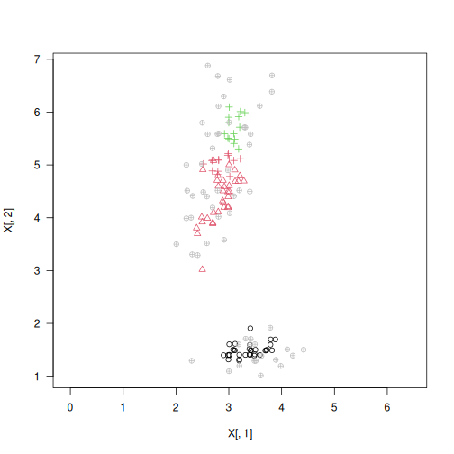

# gclust: Hierarchical Clustering Algorithm Genie

## Description

A reimplementation of *Genie* - a robust and outlier resistant clustering algorithm by Gagolewski, Bartoszuk, and Cena (2016). The Genie algorithm is based on the minimum spanning tree (MST) of the pairwise distance graph of a given point set. Just like the Single Linkage method, it consumes the edges of the MST in an increasing order of weights. However, it prevents the formation of clusters of highly imbalanced sizes; once the Gini index (see [`gini_index()`](inequality.md)) of the cluster size distribution raises above `gini_threshold`, merging a point group of the smallest size is enforced.

The clustering can also be computed with respect to the $M$-mutual reachability distance (based, e.g., on the Euclidean metric), which is used in the definition of the HDBSCAN\* algorithm (see [`mst()`](https://deadwood.gagolewski.com/rapi/mst.html) for the definition). For the smoothing factor $M>0$, outliers are pulled away from their neighbours. This way, the Genie algorithm gives an alternative to the HDBSCAN\* algorithm (Campello et al., 2013) that is able to detect a predefined number of clusters and indicate outliers (Gagolewski, 2025) without depending on DBSCAN\*\'s `eps` or HDBSCAN\*\'s `min_cluster_size` parameters.

## Usage

``` r
gclust(d, ...)

## Default S3 method:
gclust(
  d,
  gini_threshold = 0.3,
  distance = c("euclidean", "l2", "manhattan", "cityblock", "l1", "cosine"),
  verbose = FALSE,
  ...
)

## S3 method for class 'dist'
gclust(d, gini_threshold = 0.3, verbose = FALSE, ...)

## S3 method for class 'mst'
gclust(d, gini_threshold = 0.3, verbose = FALSE, ...)

genie(d, ...)

## Default S3 method:
genie(
  d,
  k,
  gini_threshold = 0.3,
  distance = c("euclidean", "l2", "manhattan", "cityblock", "l1", "cosine"),
  M = 0L,
  verbose = FALSE,
  ...
)

## S3 method for class 'dist'
genie(d, k, gini_threshold = 0.3, M = 0L, verbose = FALSE, ...)

## S3 method for class 'mst'
genie(d, k, gini_threshold = 0.3, verbose = FALSE, ...)
```

## Arguments

|  |  |
|----|----|
| `d` | a numeric matrix (or an object coercible to one, e.g., a data frame with numeric-like columns) or an object of class `dist` (see [`dist`](https://stat.ethz.ch/R-manual/R-devel/library/stats/help/dist.html)), or an object of class `mst` ([`mst`](https://deadwood.gagolewski.com/rapi/mst.html)) |
| `...` | further arguments passed to [`mst()`](https://deadwood.gagolewski.com/rapi/mst.html) |
| `gini_threshold` | threshold for the Genie correction, i.e., the Gini index of the cluster size distribution; threshold of 1.0 leads to the single linkage algorithm; low thresholds highly penalise the formation of small clusters |
| `distance` | metric used to compute the linkage, one of: `"euclidean"` (synonym: `"l2"`), `"manhattan"` (a.k.a. `"l1"` and `"cityblock"`), `"cosine"` |
| `verbose` | logical; whether to print diagnostic messages and progress information |
| `k` | the desired number of clusters to detect, $k=1$ with $M>0$ acts as an outlier detector |
| `M` | smoothing factor; $M \leq 1$ gives the selected `distance`; otherwise, the mutual reachability distance is used |

## Details

As in the case of all the distance-based methods, the standardisation of the input features is definitely worth giving a try. Oftentimes, applying some more sophisticated feature engineering techniques (e.g., dimensionality reduction) might lead to more meaningful results.

If `d` is a numeric matrix or an object of class `dist`, [`mst()`](https://deadwood.gagolewski.com/rapi/mst.html) will be called to compute an MST, which generally takes at most $O(n^2)$ time. However, by default, a faster algorithm based on K-d trees is selected automatically for low-dimensional Euclidean spaces; see [`mst_euclid`](https://quitefastmst.gagolewski.com/rapi/mst_euclid.html) from the <span class="pkg">quitefastmst</span> package.

Once a minimum spanning tree is determined, the Genie algorithm runs in $O(n \sqrt{n})$ time. If you want to test different `gini_threshold`s or `k`s, it is best to compute the MST explicitly beforehand.

Due to Genie\'s original definition, the resulting partition tree (dendrogram) might violate the ultrametricity property (merges might occur at levels that are not increasing w.r.t. a between-cluster distance). `gclust()` automatically corrects departures from ultrametricity by applying `height = rev(cummin(rev(height)))`.

## Value

`gclust()` computes the entire clustering hierarchy; it returns a list of class `hclust`; see [`hclust`](https://stat.ethz.ch/R-manual/R-devel/library/stats/help/hclust.html). Use [`cutree`](https://stat.ethz.ch/R-manual/R-devel/library/stats/help/cutree.html) to obtain an arbitrary `k`-partition.

`genie()` returns a `k`-partition, i.e., a vector whose $i$-th element denotes the $i$-th input point\'s cluster label between 1 and `k`.

## Author(s)

[Marek Gagolewski](https://www.gagolewski.com/) and other contributors

## References

Gagolewski M., Bartoszuk M., Cena A., Genie: A new, fast, and outlier-resistant hierarchical clustering algorithm, *Information Sciences* 363, 2016, 8-23, [doi:10.1016/j.ins.2016.05.003](https://doi.org/10.1016/j.ins.2016.05.003)

Campello R.J.G.B., Moulavi D., Sander J., Density-based clustering based on hierarchical density estimates, *Lecture Notes in Computer Science* 7819, 2013, 160-172, [doi:10.1007/978-3-642-37456-2_14](https://doi.org/10.1007/978-3-642-37456-2_14)

Gagolewski M., Cena A., Bartoszuk M., Brzozowski L., Clustering with minimum spanning trees: How good can it be?, *Journal of Classification* 42, 2025, 90-112, [doi:10.1007/s00357-024-09483-1](https://doi.org/10.1007/s00357-024-09483-1)

Gagolewski M., TODO, 2025

## See Also

The official online manual of <span class="pkg">genieclust</span> at <https://genieclust.gagolewski.com/>

Gagolewski, M., <span class="pkg">genieclust</span>: Fast and robust hierarchical clustering, *SoftwareX* 15:100722, 2021, [doi:10.1016/j.softx.2021.100722](https://doi.org/10.1016/j.softx.2021.100722)

[`mst()`](https://deadwood.gagolewski.com/rapi/mst.html) for the minimum spanning tree routines

[`normalized_clustering_accuracy()`](compare_partitions.md) (amongst others) for external cluster validity measures

## Examples


``` r
library("datasets")
data("iris")
X <- jitter(as.matrix(iris[2:3]))
h <- gclust(X)
y_pred <- cutree(h, 3)
y_test <- as.integer(iris[,5])
plot(X, col=y_pred, pch=y_test, asp=1, las=1)
```


``` r
adjusted_rand_score(y_test, y_pred)
```

```
## [1] 0.6956362
```

``` r
normalized_clustering_accuracy(y_test, y_pred)
```

```
## [1] 0.81
```

``` r
y_pred2 <- genie(X, 3, M=5)  # the 5-mutual reachability distance
plot(X[,1], X[,2], col=y_pred2, pch=y_test, asp=1, las=1)
is_outlier <- is.na(y_pred2)
points(X[is_outlier, ], col="gray", pch=10)
```



``` r
normalized_clustering_accuracy(y_test[!is_outlier], y_pred2[!is_outlier])
```

```
## [1] 0.81
```
