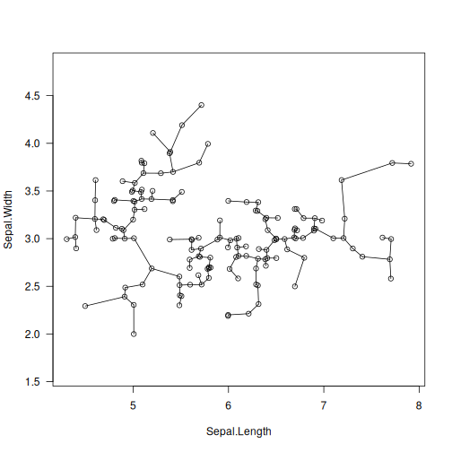

# mst: Minimum Spanning Tree of the Pairwise Distance Graph

## Description

Determine a(\*) minimum spanning tree (MST) of the complete undirected graph representing a set of $n$ points whose weights correspond to the pairwise distances between the points.

## Usage

``` r
mst(d, ...)

## Default S3 method:
mst(
  d,
  distance = c("euclidean", "l2", "manhattan", "cityblock", "l1", "cosine"),
  M = 0L,
  verbose = FALSE,
  ...
)

## S3 method for class 'dist'
mst(d, M = 0L, verbose = FALSE, ...)
```

## Arguments

|  |  |
|----|----|
| `d` | either a numeric matrix (or an object coercible to one, e.g., a data frame with numeric-like columns) or an object of class `dist`; see [`dist`](https://stat.ethz.ch/R-manual/R-devel/library/stats/help/dist.html) |
| `...` | further arguments passed to or from other methods, in particular, to [`mst_euclid`](https://quitefastmst.gagolewski.com/rapi/mst_euclid.html) from the <span class="pkg">quitefastmst</span> package |
| `distance` | metric used in the case where `d` is a matrix; one of: `"euclidean"` (synonym: `"l2"`), `"manhattan"` (a.k.a. `"l1"` and `"cityblock"`), `"cosine"` |
| `M` | smoothing factor; $M=0$ selects the requested `distance`; otherwise, the corresponding degree-`M` mutual reachability distance is used; `M` should be rather small, say, $\leq 20$ |
| `verbose` | logical; whether to print diagnostic messages and progress information |

## Details

(\*) Note that if the distances are not unique, there might be multiple minimum trees spanning a given graph.

If `d` is a matrix and the use of Euclidean distance is requested (the default), then [`mst_euclid`](https://quitefastmst.gagolewski.com/rapi/mst_euclid.html) is called to determine the MST. It is quite fast in spaces of low intrinsic dimensionality, even for 10M points.

Otherwise, a much slower generic implementation of the Jarník (Prim/Dijkstra)-like method, which requires $O(n^2)$ time, is used. The algorithm is parallelised; the number of threads is determined by the `OMP_NUM_THREADS` environment variable. As a rule of thumb, datasets up to 100k points should be processed relatively quickly.

For the smoothing factor $M>0$, the mutual reachability distance $d_M(i,j)$ (Campello et al., 2013) is used instead of the chosen \"raw\" distance $d(i,j)$. It holds $d_M(i,j)=\max(d(i,j), c_M(i), c_M(j))$, where the core distance $c_M(i)$ is the distance to the $i$-th point\'s $M$-th nearest neighbour (not including self, unlike in Campello et al., 2013). This pulls outliers away from their neighbours.

Possible ties between mutually reachability distances are resolved in such a way that connecting to a neighbour of the smallest core distance is preferred. This leads to MSTs with more leaves and hubs; see (Gagolewski, 2015) for discussion.

## Value

Returns a numeric matrix of class `mst` with $n-1$ rows and three columns: `from`, `to`, and `dist` sorted nondecreasingly. Its $i$-th row specifies the $i$-th edge of the MST which is incident to the vertices `from[i]` and `to[i]` with `from[i] < to[i]` (in 1,\...,n) and `dist[i]` gives the corresponding weight, i.e., the distance between the point pair.

The `Size` attribute specifies the number of points, $n$. The `Labels` attribute gives the labels of the input points, if available. The `method` attribute provides the name of the distance function used.

If $M>0$, the `nn.index` attribute gives the indices of the `M` nearest neighbours of each point and `nn.dist` provides the corresponding distances, both in the form of an $n$ by $M$ matrix.

## Author(s)

[Marek Gagolewski](https://www.gagolewski.com/) and other contributors

## References

Jarník V., O jistem problemu minimalnim, *Prace Moravske Prirodovedecke Spolecnosti* 6, 1930, 57-63.

Olson C.F., Parallel algorithms for hierarchical clustering, *Parallel Computing* 21, 1995, 1313-1325.

Prim R., Shortest connection networks and some generalisations, *The Bell System Technical Journal* 36(6), 1957, 1389-1401.

Borůvka O., O jistém problému minimálním, *Práce Moravské Přírodovědecké Společnosti* 3, 1926, 37--58.

Bentley J.L., Multidimensional binary search trees used for associative searching, *Communications of the ACM* 18(9), 509--517, 1975, [doi:10.1145/361002.361007](https://doi.org/10.1145/361002.361007). March W.B., Parikshit R., Gray A., Fast Euclidean minimum spanning tree: Algorithm, analysis, and applications, *Proc. 16th ACM SIGKDD Intl. Conf. Knowledge Discovery and Data Mining (KDD \'10)*, 2010, 603--612.

Campello R.J.G.B., Moulavi D., Sander J., Density-based clustering based on hierarchical density estimates, *Lecture Notes in Computer Science* 7819, 2013, 160-172, [doi:10.1007/978-3-642-37456-2_14](https://doi.org/10.1007/978-3-642-37456-2_14).

Gagolewski M., TODO, 2025

## See Also

The official online manual of <span class="pkg">genieclust</span> at <https://genieclust.gagolewski.com/>

Gagolewski, M., <span class="pkg">genieclust</span>: Fast and robust hierarchical clustering, *SoftwareX* 15:100722, 2021, [doi:10.1016/j.softx.2021.100722](https://doi.org/10.1016/j.softx.2021.100722)

[`mst_euclid`](https://quitefastmst.gagolewski.com/rapi/mst_euclid.html)

## Examples


``` r
library("datasets")
data("iris")
X <- jitter(as.matrix(iris[1:2]))  # some data
T <- mst(X)
plot(X, asp=1, las=1)
segments(X[T[, 1], 1], X[T[, 1], 2],
         X[T[, 2], 1], X[T[, 2], 2])
```


