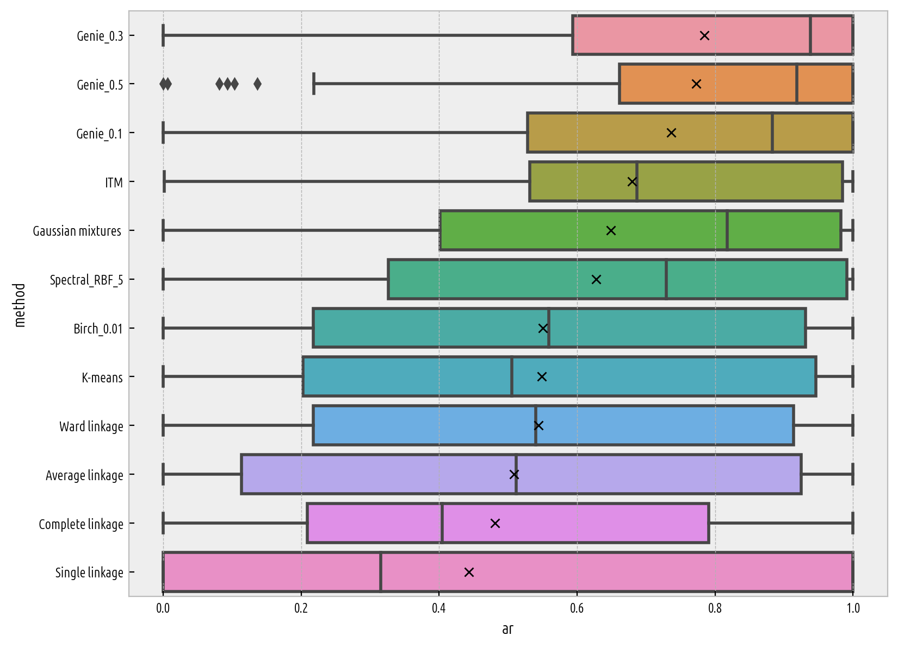
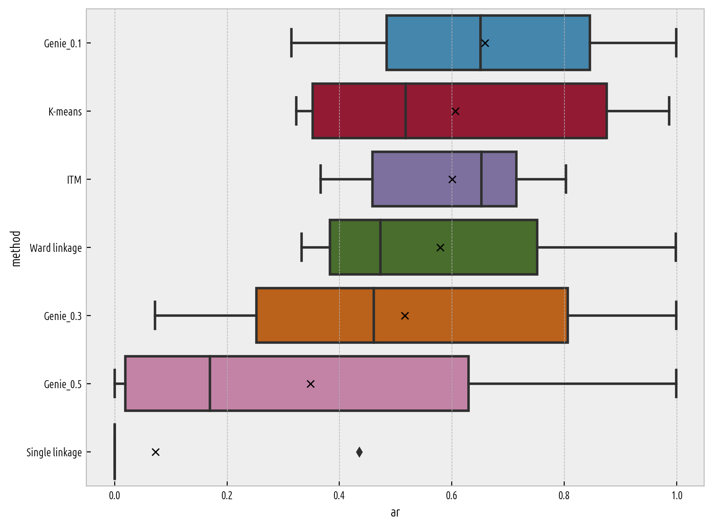

Benchmarks (How Good Is It?)
============================

In this section we evaluate the usefulness of different clustering algorithms.
We use our `framework for benchmarking clustering algorithms (benchmark suite version 1.0.1) <https://github.com/gagolews/clustering-benchmarks>`_
:cite:`clustering-benchmarks` which aggregates datasets from various sources,
including, but not limited to :cite:`uci,kmsix,fcps,graves,chameleon,xnn`.
Ground-truth/reference label vectors are provided alongside each dataset.
They define the desired number of clusters. Hence, we only study
the algorithms that allow for setting of `n_clusters` explicitly.

We will apply a few agglomerative hierarchical
methods (average, centroid, complete, single, and Ward linkage; implemented in the
`fastcluster <http://www.danifold.net/fastcluster.html>`_ package :cite:`fastclusterpkg`),
k-means, expectation-maximisation (EM) for Gaussian mixtures, Birch, spectral
(implemented in `scikit-learn <https://scikit-learn.org/>`_ :cite:`sklearn`),
`ITM <https://github.com/amueller/information-theoretic-mst>`_ :cite:`itm`,
and Genie :cite:`genieins`.

The adjusted Rand index (see :cite:`comparing_partitions`) will be used
to quantify the agreement between
a reference and a predicted clustering on the scale [0,1],
with score of 1.0 denoting perfect agreement. However, as there might be
multiple equally valid/plausible/useful partitions (see also
:cite:`sdmc` and :cite:`clustering_benchmarks_v1` for discussion),
the outputs generated by a single algorithm is evaluated
against all the available reference labellings and the maximal similarity score
is reported.

For more detailed results based on other partition similarity scores,
see the :any:`Appendix <benchmarks_details>`\ .

Small Datasets
--------------

As some of the algorithms tested here have failed to generate a solution
within reasonable time limits (e.g., spectral clustering),
in this part we restrict ourselves to the datasets with up to 10,000 observations.
As suggested in the benchmark suite's description, we omit the over-populous
"parametric" Gaussian-distributed batteries ``h2mg`` and ``g2mg``.

Here are the boxplots of the empirical distributions of the adjusted Rand index.
We report the results for Birch and spectral clustering with parameters
that lead to the highest average AR score
(the former was tested on a parameter grid of
`branching_factor in [10, 50, 100]`
and `threshold in [0.005, 0.01, 0.025, 0.05, 0.1, 0.25, 0.5, 1.0]`
and the latter on `affinity in ["rbf", "laplacian", "poly", "sigmoid"]`
and `gamma in [0.25, 0.5, 1.0, 2.5, 5.0]`).
Moreover, Gaussian mixtures used `n_init=100`.

   Distribution of the AR index for each algorithm (small datasets); best=1.0.

The Genie algorithm with `gini_threshold` of 0.3 gives the highest average
and median AR index and, at the same time, is subject to the least variability.
The (parametric!) EM algorithm fitting mixtures of Gaussians and the (perhaps lesser-known)
information-theoretic `ITM <https://github.com/amueller/information-theoretic-mst>`_
:cite:`itm` method (which is also based on a minimum spanning tree)
tend to output good quality outcomes as well.

Descriptive statistics for the ranks (for each dataset,
each algorithm that gets the highest AR index rounded to 2 decimal digits,
gets a rank of 1); lower ranks are better:

=================  =======  ======  =====  =====  =====  =====  =====  =====
..                   count    mean    std    min    25%    50%    75%    max
=================  =======  ======  =====  =====  =====  =====  =====  =====
Average linkage         73     6.9    3.6      1      5      7     10     13
Birch_0.01              73     6.1    3.1      1      4      6      8     13
Centroid linkage        73     7.1    3.7      1      5      8     10     13
Complete linkage        73     8.3    3.4      1      6      9     11     13
Gaussian mixtures       73     4.3    3.8      1      1      2      6     13
Genie_0.1               73     3.8    3.6      1      1      3      5     13
Genie_0.3               73     3.5    3.3      1      1      2      5     12
Genie_0.5               73     4.4    4.1      1      1      2      8     12
ITM                     73     5.5    4.3      1      1      5      9     13
K-means                 73     6      4        1      1      6      9     13
Single linkage          73     7.9    5.5      1      1     11     13     13
Spectral_RBF_5          73     5.4    3.7      1      1      6      8     13
Ward linkage            73     6.4    3.2      1      4      7      8     13
=================  =======  ======  =====  =====  =====  =====  =====  ===== 

Large Datasets
--------------

Below we provide the results for the larger datasets (70,000-105,600 points).

   Distribution of the AR index for each algorithm (large datasets); best=1.0.

This time, the ITM method and Genie with `gini_threshold` of 0.1 give
the highest typical scores.

Descriptive statistics for the ranks (AR index):

================  =======  ======  =====  =====  =====  =====  =====  =====
..                  count    mean    std    min    25%    50%    75%    max
================  =======  ======  =====  =====  =====  =====  =====  =====
Centroid linkage        6     5.3    2.4      1    4.5    6.5    7        7
Genie_0.1               6     1.8    1.2      1    1      1.5    2        4
Genie_0.3               6     3.2    1.7      1    2      3      4.8      5
Genie_0.5               6     5      2        1    5.2    6      6        6
ITM                     6     3.7    2.7      1    1.5    3      6        7
K-means                 6     3.5    1.9      1    2.2    3.5    4.8      6
Single linkage          6     7.3    0.8      6    7      7.5    8        8
Ward linkage            6     3.3    1.6      1    2.2    3.5    4.8      5
================  =======  ======  =====  =====  =====  =====  =====  ===== 

Summary
-------

Overall, the Genie algorithm tends to outperform other algorithms considered
in this study, at least on this rich benchmark battery.
In :cite:`genieins`, based on a much smaller sample of reference datasets,
we have recommended `gini_threshold` of 0.3,
which is set as the default also in the `genieclust` package.
However, sometimes inspecting thresholds equal to 0.1 and 0.5 is worth a try.
interestingly, the algorithm is quite stable in the sense that
small changes of this parameter should not affect the generated clusterings
in a significant way.

