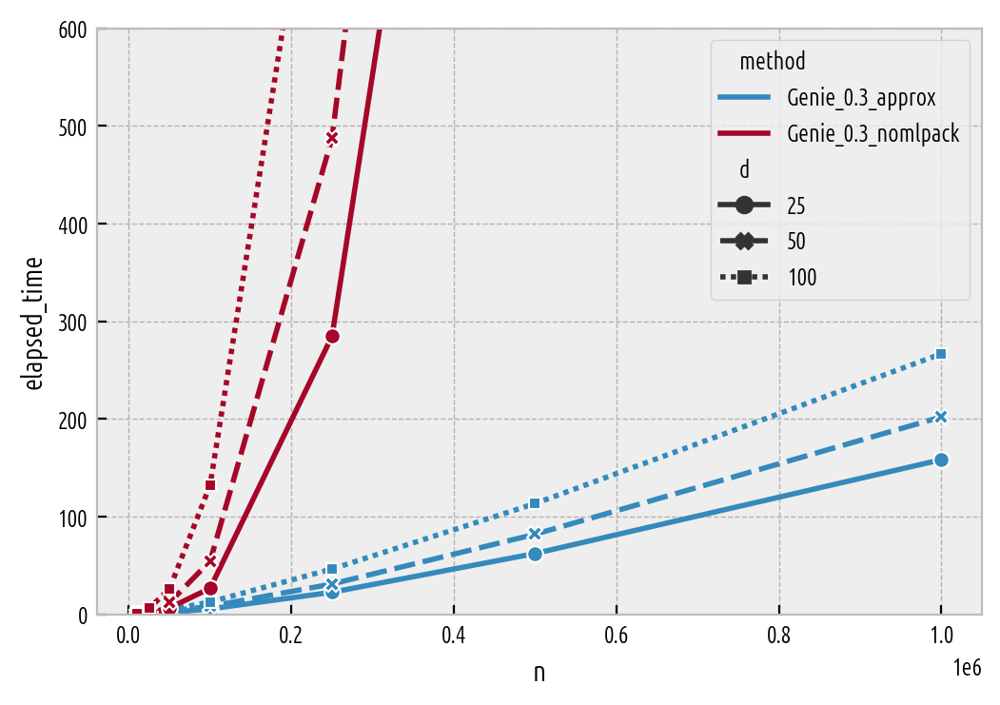
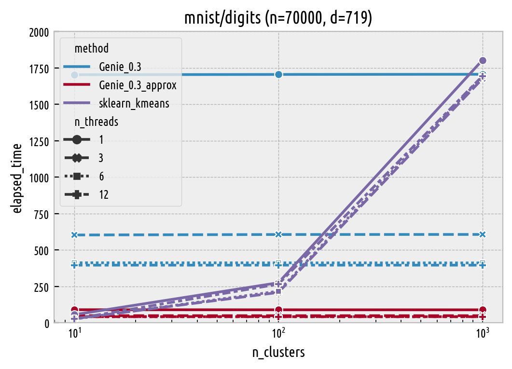

Timings (How Fast Is It?)
=========================

In the :any:`previous section <benchmarks_ar>` we have demonstrated
that Genie generates partitions of high *quality*. Now the crucial question is:
does it do this quickly?

Genie will be compared against K-means from `scikit-learn <https://scikit-learn.org/>`_
:cite:`sklearn` version 0.23.1
(`sklearn.cluster.KMeans`) for different number of threads
(by default it uses all available resources;
note that the number of restarts, `n_init`, defaults to 10)
and hierarchical agglomerative algorithms
with the centroid, median, and Ward linkage implemented in the
`fastcluster <http://www.danifold.net/fastcluster.html>`_ package
:cite:`fastclusterpkg`.

Genie, just like the single linkage, is based on a minimum spanning tree (MST)
:cite:`clustering-msts` of the pairwise distance graph of an input point set.
Given the MST (the slow part), Genie itself has :math:`O(n \sqrt{n})` time
and :math:`O(n)` memory complexity.
Generally, our parallelised implementation of a Jarník (Prim/Dijkstra)-like
method  :cite:`olson` will be called to compute an MST, which takes :math:`O(d n^2)` time.
However, `mlpack.emst <https://www.mlpack.org/>`_ :cite:`mlpack` provides a very fast
alternative in the case of Euclidean spaces of (very) low dimensionality,
see :cite:`emst` and the `mlpack_enabled` parameter, which is automatically used
for datasets with up to :math:`d=6` features.
Moreover, in the approximate method (`exact` = ``False``), we apply
the Kruskal algorithm on the near-neighbour graph determined
by `nmslib` :cite:`nmslib`\ . Albeit this only gives *some* sort of a spanning *forest*,
such a data structure :any:`turns out to be very suitable for our clustering task <benchmarks_approx>`\ .

All timings will be performed on a PC running GNU/Linux 5.4.0-40-generic #44-Ubuntu
SMP x86_64 kernel with an Intel(R) Core(TM) i7-9750H CPU @ 2.60GHz (12M cache, 6 cores, 12 threads)
and total memory of 16,242,084 kB.

Large Datasets
--------------

Let's study the algorithm's run times for some of the
"larger" datasets (70,000-105,600 observations,
see section on :any:`benchmark results <benchmarks_ar>` for discussion)
from the
`Benchmark Suite for Clustering Algorithms — Version 1 <https://github.com/gagolews/clustering-benchmarks>`_
:cite:`clustering_benchmarks_v1`\ .
Features with variance of 0 were removed,
datasets were centred at **0** and scaled so that they have total variance of 1.
Tiny bit of Gaussian noise was added to each observation.
Clustering is performed with respect to the Euclidean distance.

Here are the results (in seconds) if 6 threads are requested
(except for `fastcluster` which is not parallelised).
For K-means, the timings are listed as a function of the number of clusters to detect,
for the other hierarchical methods the run-times are almost identical irrespective of the
partitions' cardinality.

=============  ======  ===  ====================  =======  ======  =======
dataset        n       d    method                     10     100     1000
=============  ======  ===  ====================  =======  ======  =======
mnist/digits   70000   719  Genie_0.3              412.72        
..                          Genie_0.3_approx        42.77        
..                          fastcluster_centroid  4170.98        
..                          fastcluster_median    3927.93        
..                          fastcluster_ward      4114.05        
..                          sklearn_kmeans          26.3   217.62  1691.68
mnist/fashion  70000   784  Genie_0.3              445.81        
..                          Genie_0.3_approx        38.02        
..                          fastcluster_centroid  4486.32        
..                          fastcluster_median    4384.62        
..                          fastcluster_ward      4757.32        
..                          sklearn_kmeans          24.9   225.04  1745.88
sipu/worms_2   105600  2    Genie_0.3                0.57        
..                          Genie_0.3_approx         3.67        
..                          fastcluster_centroid    66.3         
..                          fastcluster_median      64.11        
..                          fastcluster_ward        60.92        
..                          sklearn_kmeans           0.86   10.96   111.9
sipu/worms_64  105000  64   Genie_0.3               76.7         
..                          Genie_0.3_approx         8.26        
..                          fastcluster_centroid  4945.91        
..                          fastcluster_median    2854.27        
..                          fastcluster_ward       778.18        
..                          sklearn_kmeans           3.35   37.89   357.84
=============  ======  ===  ====================  =======  ======  ======= 

Of course, the K-means algorithm is the fastest.
However, its performance degrades as K increases. Hence, it might not be
a good choice for the so-called *extreme clustering* (compare :cite:`extreme`)
problems. Most importantly, the approximate version of Genie (based on `nmslib`)
is only slightly slower.
The exact variant is extremely performant in Euclidean spaces of low dimensionality
(thanks to `mlpack`) and overall at least 10 times more efficient than the other
hierarchical algorithms in this study.

Timings as a Function of `n` and `d`
------------------------------------

In order to study the run-times as a function dataset size and dimensionality,
let's consider a series of synthetic benchmarks, each with two Gaussian blobs of size `n/2`
(with i.i.d. coordinates), in a `d`-dimensional space.

Here are the medians of 3-10 timings (depending on the dataset size), in seconds,
on 6 threads:

==================  ===  =======  =======  ========  ========  =========
method                d    10000    50000    100000    500000    1000000
==================  ===  =======  =======  ========  ========  =========
Genie_0.3_approx      2     0.17     0.98      2.12     14.93      33.79
..                    5     0.2      1.3       2.87     22.75      54.66
..                   10     0.25     1.69      3.84     36.18      92.03
..                   25     0.29     1.95      5.46     62.25     158.27
..                   50     0.36     3.15      8.15     81.95     202.08
..                  100     0.48     4.6      12.6     113.37     266.64
Genie_0.3_mlpack      2     0.04     0.26      0.55      3.03       6.58
..                    5     0.28     1.96      4.46     28.4       62.75
..                   10     3.08    35.54     92.87    794.71    2014.59
Genie_0.3_nomlpack    2     0.16     2.52      9.87    267.76    1657.86
..                    5     0.14     2.62     11.4     421.46    2997.11
..                   10     0.15     3.21     12.74    719.33    4388.26
..                   25     0.28     6.51     26.65   1627.9     7708.23
..                   50     0.47    11.97     54.52   2175.3    11346.3
..                  100     1       26.07    132.47   4408.07   16021.8
==================  ===  =======  =======  ========  ========  ========= 

By default, `mlpack_enabled` is ``"auto"``, which translates
to ``True`` if the requested metric is Euclidean,  Python package `mlpack` is available,
and `d` is not greater than 6.
The effect of the curse of dimensionality is clearly visible -- clustering
in very low-dimensional Euclidean spaces is extremely fast.
On the other hand, the approximate version of Genie can easily cluster
very large datasets. Only the system's memory limits might become a problem then.

   Timings [s] as a function of the dataset size and dimensionality — problem sizes that can be solved in a few minutes.

Timings as a Function of the Number of Threads
----------------------------------------------

Recall that the timings are done on a PC with 6 physical cores.
Genie turns out to be nicely parallelisable — as evidenced on
the ``mnist/digits`` dataset:

   Timings [s] as a function of the number of clusters and threads.

Summary
-------

The approximate (`exact` = ``False``) version of Genie is much faster
than the original one. At the same time, it is still
:any:`highly compatible <benchmarks_approx>` with it
(at least at higher levels of the cluster hierarchy). Therefore, we
can safely recommend its use in large problem instances.
Most importantly, its performance is not much worse than the K-means method
with small K. Once a complete cluster hierarchy is determined,
partitioning of any cardinality can be extracted in less than 0.34 s on a 1M dataset.
Still, even the exact Genie is amongst the fastest clustering algorithms in the pool.

On top of that, we are also allowed to change our mind about the `gini_threshold`
parameter once the clustering is has been determined. The MST is stored for further
reference and is not recomputed unless needed. Here are the timings for
a first run of the algorithm:

.. code-block:: python

    import time, genieclust, numpy as np
    X = np.loadtxt("worms_2.data.gz", ndmin=2)
    g = genieclust.Genie(n_clusters=2, gini_threshold=0.3)
    t0 = time.time()
    g.fit(X)
    print("time elapsed - first run: %.3f" % (time.time()-t0))

::

    ## time elapsed - first run: 0.850

Changing some parameters and re-running the cluster search:

.. code-block:: python

    g.set_params(n_clusters=10)
    g.set_params(gini_threshold=0.1)
    t0 = time.time()
    g.fit(X)
    print("time elapsed - consecutive run: %.3f" % (time.time()-t0))

::

    ## time elapsed - consecutive run: 0.027

