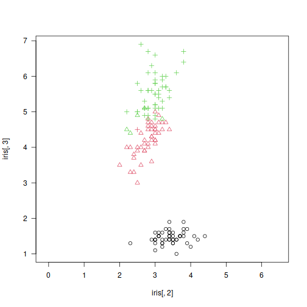

::: {.container}
# gclust: The Genie++ Hierarchical Clustering Algorithm

## Description

A reimplementation of *Genie* - a robust and outlier resistant clustering algorithm (see Gagolewski, Bartoszuk, Cena, 2016). The Genie algorithm is based on a minimum spanning tree (MST) of the pairwise distance graph of a given point set. Just like single linkage, it consumes the edges of the MST in increasing order of weights. However, it prevents the formation of clusters of highly imbalanced sizes; once the Gini index (see [`gini_index()`](inequity.md)) of the cluster size distribution raises above `gini_threshold`, a forced merge of a point group of the smallest size is performed. Its appealing simplicity goes hand in hand with its usability; Genie often outperforms other clustering approaches on benchmark data, such as <https://github.com/gagolews/clustering_benchmarks_v1>.

The clustering can now also be computed with respect to the mutual reachability distance (based, e.g., on the Euclidean metric), which is used in the definition of the HDBSCAN\* algorithm (see Campello et al., 2015). If `M` \> 1, then the mutual reachability distance *m(i,j)* with smoothing factor `M` is used instead of the chosen \"raw\" distance *d(i,j)*. It holds *m(i,j)=\\max(d(i,j), c(i), c(j))*, where *c(i)* is *d(i,k)* with *k* being the (`M`-1)-th nearest neighbour of *i*. This makes \"noise\" and \"boundary\" points being \"pulled away\" from each other.

The Genie correction together with the smoothing factor `M` \> 1 (note that `M` = 2 corresponds to the original distance) gives a robustified version of the HDBSCAN\* algorithm that is able to detect a predefined number of clusters. Hence it does not dependent on the DBSCAN\'s somewhat magical `eps` parameter or the HDBSCAN\'s `min_cluster_size` one.

## Usage

```r
gclust(d, ...)

## Default S3 method:
gclust(
  d,
  gini_threshold = 0.3,
  distance = c("euclidean", "l2", "manhattan", "cityblock", "l1", "cosine"),
  cast_float32 = TRUE,
  verbose = FALSE,
  ...
)

## S3 method for class 'dist'
gclust(d, gini_threshold = 0.3, verbose = FALSE, ...)

## S3 method for class 'mst'
gclust(d, gini_threshold = 0.3, verbose = FALSE, ...)

genie(d, ...)

## Default S3 method:
genie(
  d,
  k,
  gini_threshold = 0.3,
  distance = c("euclidean", "l2", "manhattan", "cityblock", "l1", "cosine"),
  M = 1L,
  postprocess = c("boundary", "none", "all"),
  detect_noise = M > 1L,
  cast_float32 = TRUE,
  verbose = FALSE,
  ...
)

## S3 method for class 'dist'
genie(
  d,
  k,
  gini_threshold = 0.3,
  M = 1L,
  postprocess = c("boundary", "none", "all"),
  detect_noise = M > 1L,
  verbose = FALSE,
  ...
)

## S3 method for class 'mst'
genie(
  d,
  k,
  gini_threshold = 0.3,
  postprocess = c("boundary", "none", "all"),
  detect_noise = FALSE,
  verbose = FALSE,
  ...
)
```

## Arguments

|                  |                                                                                                                                                                                                                                                                                                                                                                                      |
|------------------|--------------------------------------------------------------------------------------------------------------------------------------------------------------------------------------------------------------------------------------------------------------------------------------------------------------------------------------------------------------------------------------|
| `d`              | a numeric matrix (or an object coercible to one, e.g., a data frame with numeric-like columns) or an object of class `dist`, see [`dist`](https://stat.ethz.ch/R-manual/R-devel/library/stats/help/dist.html) or an object of class `mst`, see [`mst()`](mst.md).                                                                                                                    |
| `...`            | further arguments passed to other methods.                                                                                                                                                                                                                                                                                                                                           |
| `gini_threshold` | threshold for the Genie correction, i.e., the Gini index of the cluster size distribution; Threshold of 1.0 disables the correction. Low thresholds highly penalise the formation of small clusters.                                                                                                                                                                                 |
| `distance`       | metric used to compute the linkage, one of: `"euclidean"` (synonym: `"l2"`), `"manhattan"` (a.k.a. `"l1"` and `"cityblock"`), `"cosine"`.                                                                                                                                                                                                                                            |
| `cast_float32`   | logical; whether to compute the distances using 32-bit instead of 64-bit precision floating-point arithmetic (up to 2x faster).                                                                                                                                                                                                                                                      |
| `verbose`        | logical; whether to print diagnostic messages and progress information.                                                                                                                                                                                                                                                                                                              |
| `k`              | the desired number of clusters to detect, `k` = 1 with `M` \> 1 acts as a noise point detector.                                                                                                                                                                                                                                                                                      |
| `M`              | smoothing factor; `M` \<= 2 gives the selected `distance`; otherwise, the mutual reachability distance is used.                                                                                                                                                                                                                                                                      |
| `postprocess`    | one of `"boundary"` (default), `"none"` or `"all"`; in effect only if `M` \> 1. By default, only \"boundary\" points are merged with their nearest \"core\" points (A point is a boundary point if it is a noise point and it\'s amongst its adjacent vertex\'s `M`-1 nearest neighbours). To force a classical k-partition of a data set (with no notion of noise), choose \"all\". |
| `detect_noise`   | whether the minimum spanning tree\'s leaves should be marked as noise points, defaults to `TRUE` if `M` \> 1 for compatibility with HDBSCAN\*.                                                                                                                                                                                                                                       |

## Details

Note that as in the case of all the distance-based methods, the standardisation of the input features is definitely worth giving a try.

If `d` is a numeric matrix or an object of class `dist`, [`mst()`](mst.md) will be called to compute an MST, which generally takes at most *O(n\^2)* time (the algorithm we provide is parallelised, environment variable `OMP_NUM_THREADS` controls the number of threads in use). However, see [`emst_mlpack()`](emst_mlpack.md) for a very fast alternative in the case of Euclidean spaces of (very) low dimensionality and `M` = 1.

Given an minimum spanning tree, the algorithm runs in *O(n √{n})* time. Therefore, if you want to test different `gini_threshold`s, (or `k`s), it is best to explicitly compute the MST first.

According to the algorithm\'s original definition, the resulting partition tree (dendrogram) might violate the ultrametricity property (merges might occur at levels that are not increasing w.r.t. a between-cluster distance). Departures from ultrametricity are corrected by applying `height = rev(cummin(rev(height)))`.

## Value

`gclust()` computes the whole clustering hierarchy; it returns a list of class `hclust`, see [`hclust`](https://stat.ethz.ch/R-manual/R-devel/library/stats/help/hclust.html). Use `link{cutree}()` to obtain an arbitrary k-partition.

`genie()` returns a `k`-partition - a vector with elements in 1,\...,k, whose i-th element denotes the i-th input point\'s cluster identifier. Missing values (`NA`) denote noise points (if `detect_noise` is `TRUE`).

## References

Gagolewski M., Bartoszuk M., Cena A., Genie: A new, fast, and outlier-resistant hierarchical clustering algorithm, *Information Sciences* 363, 2016, 8-23.

Campello R., Moulavi D., Zimek A., Sander J., Hierarchical density estimates for data clustering, visualization, and outlier detection, ACM Transactions on Knowledge Discovery from Data 10(1), 2015, 5:1--5:51.

## See Also

[`mst()`](mst.md) for the minimum spanning tree routines.

[`adjusted_rand_score()`](comparing_partitions.md) (amongst others) for external cluster validity measures (partition similarity scores).

## Examples


```r
library("datasets")
data("iris")
X <- iris[1:4]
h <- gclust(X)
y_pred <- cutree(h, 3)
y_test <- iris[,5]
plot(iris[,2], iris[,3], col=y_pred,
   pch=as.integer(iris[,5]), asp=1, las=1)
```



```r
adjusted_rand_score(y_test, y_pred)
## [1] 0.8857921
pair_sets_index(y_test, y_pred)
## [1] 0.9049708
# Fast for low-dimensional Euclidean spaces:
h <- gclust(emst_mlpack(X))
```
:::
