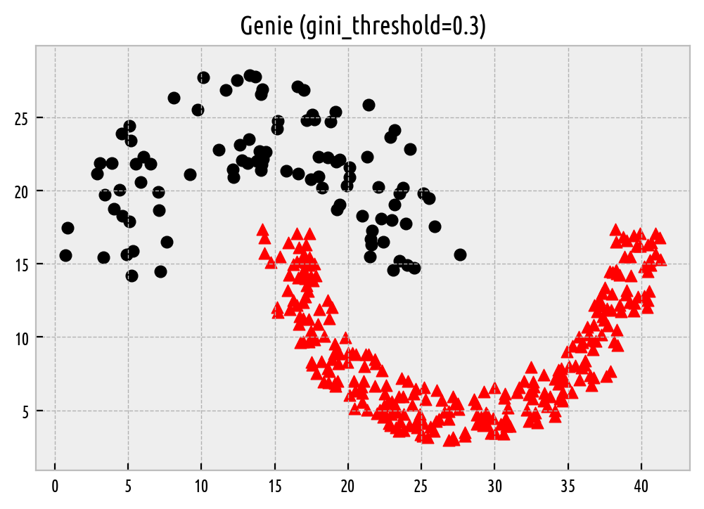
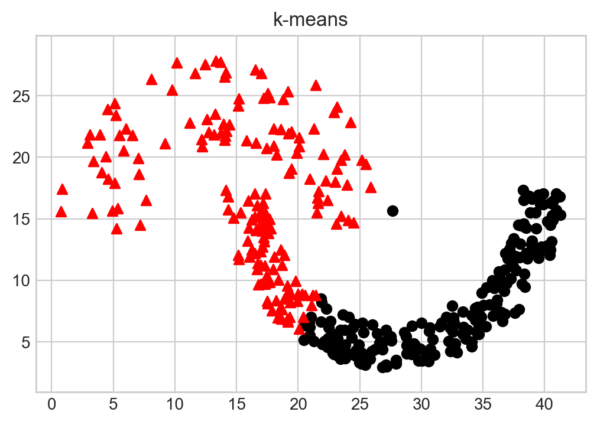
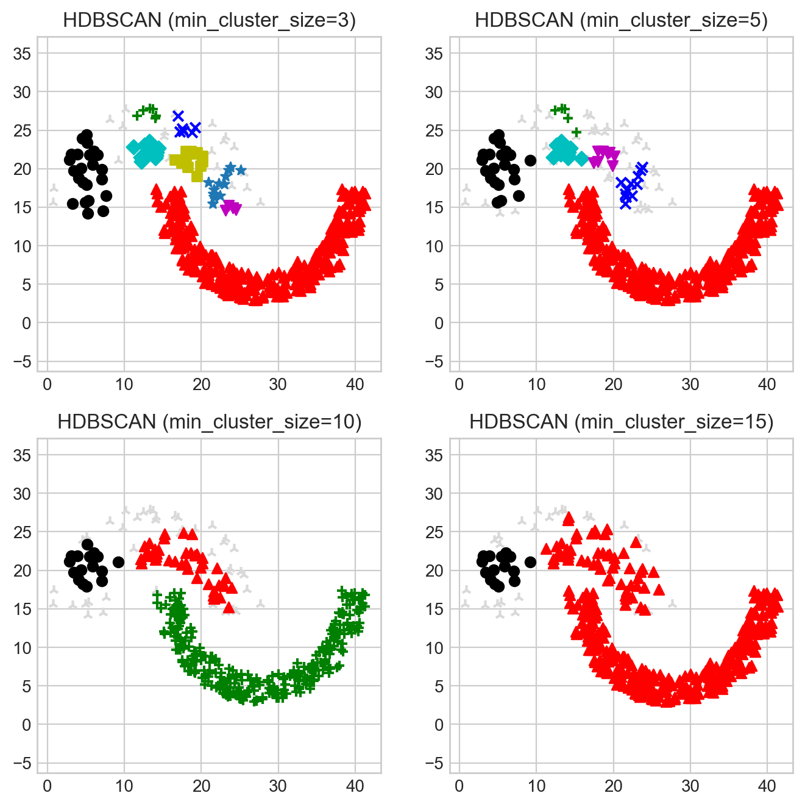
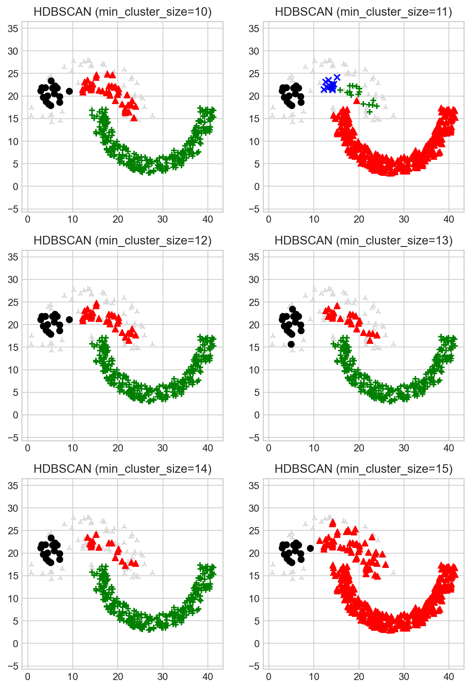

Basics
======

*Genie* [1]_ is an agglomerative hierarchical clustering
algorithm that links clusters minding that
the Gini index (a popular measure of inequity used in, amongst others,
economics) of the cluster sizes should not go too far beyond a given threshold.
In one of the sections below we shall show
that Genie most often outperforms many other methods
in terms of clustering quality on benchmark data and speed.

Here are a few examples of basic interactions with the Python version
of the `genieclust` package.

.. code:: python

    import numpy as np
    import pandas as pd
    import matplotlib.pyplot as plt
    import genieclust

Breaking the Ice
----------------

Let's load an example benchmark set, ``jain`` [2]_, which  comes along
with the true corresponding partition (by an expert).

.. code:: python

    dataset = "jain"
    # Load an example 2D dataset:
    X = np.loadtxt("%s.data.gz" % dataset, ndmin=2)
    
    # Load the corresponding reference labels. The original labels are in {1,2,..,k}.
    # We'll make them more Python-ish by subtracting 1.
    labels_true = np.loadtxt("%s.labels0.gz" % dataset, dtype=np.intp)-1
    
    # The number of unique labels gives the true cluster count:
    n_clusters = len(np.unique(labels_true))

A scatter plot of the dataset together with the reference labels:

.. code:: python

    genieclust.plots.plot_scatter(X, labels=labels_true)
    plt.title("%s (n=%d, true n_clusters=%d)" % (dataset, X.shape[0], n_clusters))
    plt.axis("equal")
    plt.show()

.. figure:: figures/basics_basics-scatter_1.png
   :width: 15 cm

   Reference labels.

Let's apply the Genie algorithm (with the default/recommended
``gini_threshold`` parameter value). The `genieclust` package's interface
is compatible with the one from the popular
`scikit-learn <https://scikit-learn.org/>`_ library.
In particular, an object of class `Genie` is equipped with the
`fit` and `fit_predict` methods.

.. code:: python

    g = genieclust.Genie(n_clusters=n_clusters)
    print(g)

.. code::

    Genie(M=1, affinity='l2', cast_float32=True, compute_all_cuts=False,
          compute_full_tree=False, exact=True, gini_threshold=0.3,
          mlpack_enabled='auto', mlpack_leaf_size=1, n_clusters=2,
          nmslib_n_neighbors=64, nmslib_params_index={'post': 2},
          nmslib_params_init={'method': 'hnsw'}, nmslib_params_query={},
          postprocess='boundary', verbose=False)
    

.. code:: python

    labels_genie = g.fit_predict(X)

Plotting of the discovered partition:

.. code:: python

    genieclust.plots.plot_scatter(X, labels=labels_genie)
    plt.title("Genie (gini_threshold=%g)" % g.gini_threshold)
    plt.axis("equal")
    plt.show()

   Labels predicted by Genie.

Nice.

A picture is worth a thousand words, but numbers are worth
millions of pictures. We can compare the resulting clustering with the reference
one by computing, for example, the confusion matrix.

.. code:: python

    # Compute the confusion matrix (with pivoting)
    genieclust.compare_partitions.normalized_confusion_matrix(labels_true, labels_genie)

.. code::

    array([[276,   0],
           [  0,  97]])
    

The above confusion matrix can be summarised by means of partition
similarity measures, like the Adjusted Rand Index (``ar``).

.. code:: python

    # See also: sklearn.metrics.adjusted_rand_score()
    genieclust.compare_partitions.adjusted_rand_score(labels_true, labels_genie)

.. code::

    1.0
    

Which of course denotes a perfect match between these two.

A Comparison with k-means
-------------------------

For the sake of comparison, let's apply the k-means algorithm on the same dataset.

.. code:: python

    import sklearn.cluster
    km = sklearn.cluster.KMeans(n_clusters=n_clusters)
    labels_kmeans = km.fit_predict(X)
    genieclust.plots.plot_scatter(X, labels=labels_kmeans)
    plt.title("k-means")
    plt.axis("equal")
    plt.show()

   Labels predicted by k-means.

It is well known that the k-means algorithm can only split the input space into
convex regions (compare the notion of the
`Voronoi diagrams <https://en.wikipedia.org/wiki/Voronoi_diagram>`_).
So we shouldn't be much surprised with this result.

.. code:: python

    # Compute the confusion matrix for the k-means output:
    genieclust.compare_partitions.normalized_confusion_matrix(labels_true, labels_kmeans)

.. code::

    array([[197,  79],
           [  1,  96]])
    

.. code:: python

    # A cluster similarity measure for k-means:
    genieclust.compare_partitions.adjusted_rand_score(labels_true, labels_kmeans)

.. code::

    0.3241080446115835
    

The adjusted Rand score of :math:`\sim 0.3` indicates a far-from-perfect fit.

A Comparison with HDBSCAN\*
---------------------------

Let's also make a comparison against a version of the DBSCAN [4]_, [5]_
algorithm. The original DBSCAN relies on a somehow magical ``eps`` parameter,
which might be hard to tune in practice. Fortunately,
the `hdbscan <https://github.com/scikit-learn-contrib/hdbscan>`_ package
implements its robustified variant [3]_, which makes the algorithm much
more user-friendly.

Here are the clustering results with the ``min_cluster_size`` parameter
of 3, 5, 10, and 15:

.. code:: python

    import hdbscan
    mcs = [3, 5, 10, 15]
    for i in range(len(mcs)):
        h = hdbscan.HDBSCAN(min_cluster_size=mcs[i])
        labels_hdbscan = h.fit_predict(X)
        plt.subplot(2, 2, i+1)
        genieclust.plots.plot_scatter(X, labels=labels_hdbscan)
        plt.title("HDBSCAN (min_cluster_size=%d)" % h.min_cluster_size)
        plt.axis("equal")
    
    plt.show()

   Labels predicted by HDBSCAN\*.

Side note.
    Gray plotting symbols denote "noise" points — we'll get back to them
    in another section; it turns out that the Genie algorithm is also equipped
    with such a feature (on demand).

In HDBSCAN\*,  ``min_cluster_size`` affects the "granularity"
of the obtained clusters. Its default value is set to:

.. code:: python

    hdbscan.HDBSCAN().min_cluster_size

.. code::

    5
    

Unfortunately, we cannot easily guess how many clusters will be generated
by this method. At a first glance, it would seem that ``min_cluster_size``
should lie somewhere between 10 and 15, but...

.. code:: python

    mcs = range(10, 16)
    for i in range(len(mcs)):
        h = hdbscan.HDBSCAN(min_cluster_size=mcs[i])
        labels_hdbscan = h.fit_predict(X)
        plt.subplot(3, 2, i+1)
        genieclust.plots.plot_scatter(X, labels=labels_hdbscan)
        plt.title("HDBSCAN (min_cluster_size=%d)"%h.min_cluster_size)
        plt.axis("equal")
    
    plt.show()

   Labels predicted by HDBSCAN\*.

Strangely enough, ``min_cluster_size`` of :math:`11` generates 4 clusters,
whereas :math:`11\pm 1` - only 3 of them.

On the other hand, the Genie algorithm belongs
to the group of *hierarchical agglomerative methods* — by definition
it's able to generate
a sequence of *nested* partitions, which means that by
increasing ``n_clusters``, we split one and only one cluster
into two subgroups.
This makes the resulting partitions more stable.

.. code:: python

    ncl = range(2, 8)
    for i in range(len(ncl)):
        g = genieclust.Genie(n_clusters=ncl[i])
        labels_genie = g.fit_predict(X)
        plt.subplot(3, 2, i+1)
        genieclust.plots.plot_scatter(X, labels=labels_genie)
        plt.title("Genie (n_clusters=%d)"%(g.n_clusters,))
        plt.axis("equal")
    plt.show()

.. figure:: figures/basics_basics-plot-genie2_1.png
   :width: 15 cm

   Labels predicted by Genie.

References
----------

.. [1]
    Gagolewski M., Bartoszuk M., Cena A.,  Genie: A new, fast and
    outlier-resistant hierarchical clustering algorithm,
    *Information Sciences* 363, 2016, 8-23. doi:10.1016/j.ins.2016.05.003.

.. [2]
    Jain A., Law M., Data clustering: A user's dilemma,
    *Lecture Notes in Computer* Science 3776, 2005, 1-10.

.. [3]
    Campello R., Moulavi D., Zimek A., Sander J.,
    Hierarchical density estimates for data clustering, visualization,
    and outlier detection,
    *ACM Transactions on Knowledge Discovery from Data* 10(1), 2015, 5:1-5:51.
    doi:10.1145/2733381.

.. [4]
    Ling R.F., A probability theory of cluster analysis,
    *Journal of the American Statistical Association*, 68(341), 1973, 159-164.

.. [5]
    Ester M., Kriegel H.P., Sander J., Xu X., A density-based
    algorithm for discovering clusters in large spatial databases with noise,
    *Proc. KDD'96*, 1996, 226-231.

