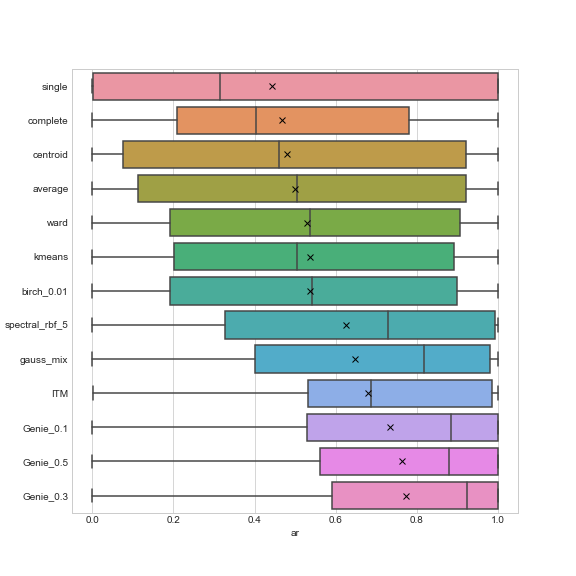
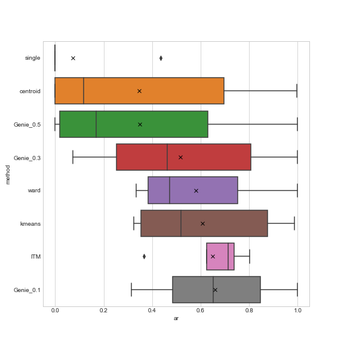

Benchmarks
==========

In this section we evaluate the usefulness of different clustering algorithms. We consider the `Benchmark Suite for Clustering Algorithms - Version 1 <https://github.com/gagolews/clustering_benchmarks_v1>`__  [1]_ which aggregates datasets from various sources, including, but not limited to  [2]_,  [3]_,  [4]_,  [5]_,  [6]_,  [7]_. Ground-truth/reference label vectors are provided alongside each dataset. They define the desired number of clusters, K, and hence only the algorithms that allow for setting ``n_clusters`` explicitly are studied here: agglomerative hierarchical methods (average, centroid, complete, single, and Ward linkage, implemented in the `fastcluster <http://www.danifold.net/fastcluster.html>`__ package), k-means, expectation-maximisation (EM) for Gaussian mixtures, BIRCH, spectral (implemented in `scikit-learn <https://scikit-learn.org/>`__), `ITM <https://github.com/amueller/information-theoretic-mst>`__  [8]_, and Genie  [9]_.

The adjusted Rand index (see  [10]_) is used to quantify the agreement between the reference and the generated clustering on the scale :math:`[0,1]`, with score of 1.0 denoting perfect agreement. However, as there might be multiple equally valid/plausible/useful partitions (see also  [11]_ and  [12]_ for discussion), the outputs generated by a single algorithm is evaluated against all the available reference labellings and the maximal similarity score is reported.

For more detailed results based on other partition similarity scores, see Appendix.

Small Datasets
--------------

As some of the algorithms failed to converge within reasonable time limits, in this part we restrict ourselves to the datasets with up to 10000 observations. As suggested in the suite description, we omit the “parametric” Gaussian-distributed batteries ``h2mg`` and ``g2mg``.

Here are the boxplots of the empirical distributions of the adjusted Rand index. We report the results for BIRCH and spectral clustering with parameters that lead to the highest average AR-index.

   Distribution of the AR-index for each algorithm (small datasets).

..

   The Genie algorithm with ``gini_threshold`` of 0.3 gives the highest average and median AR-index and, at the same time, is subject to the least variability. The EM algorithm fitting mixtures of Gaussians and the (perhaps lesser-known) information-theoretic `ITM <https://github.com/amueller/information-theoretic-mst>`__ method (which is also based on a minimum spanning tree) tend to output results of good quality as well.

Descriptive statistics for the ranks (for each dataset, each algorithm that gets the highest AR-index rounded to 2 decimal digits, gets a rank of 1); lower ranks are better:

============== ===== ==== === === === === === ===
method         count mean std min 25% 50% 75% max
============== ===== ==== === === === === === ===
Genie_0.1      73    3.8  3.6 1   1   3   5   13
Genie_0.3      73    3.5  3.3 1   1   2   5   12
Genie_0.5      73    4.4  4.1 1   1   2   8   12
ITM            73    5.5  4.3 1   1   5   9   13
average        73    6.9  3.6 1   5   7   10  13
birch_0.01     73    6.1  3.1 1   4   6   8   13
centroid       73    7.1  3.7 1   5   8   10  13
complete       73    8.3  3.4 1   6   9   11  13
gauss_mix      73    4.3  3.8 1   1   2   6   13
kmeans         73    6    4   1   1   6   9   13
single         73    7.9  5.5 1   1   11  13  13
spectral_rbf_5 73    5.4  3.7 1   1   6   8   13
ward           73    6.4  3.2 1   4   7   8   13
============== ===== ==== === === === === === ===

Large Datasets
--------------

Below we provide the results for the larger datasets (70000-105600 points).

   Distribution of the AR-index for each algorithm (large datasets).

..

   This time, the ITM method and Genie with ``gini_threshold`` of 0.1 give the highest typical scores.

Descriptive statistics for the ranks (AR-index):

========= ===== ==== === === === === === ===
method    count mean std min 25% 50% 75% max
========= ===== ==== === === === === === ===
Genie_0.1 6     1.8  1.2 1   1   1.5 2   4
Genie_0.3 6     3.2  1.7 1   2   3   4.8 5
Genie_0.5 6     5    2   1   5.2 6   6   6
ITM       6     3.7  2.7 1   1.5 3   6   7
centroid  6     5.3  2.4 1   4.5 6.5 7   7
kmeans    6     3.5  1.9 1   2.2 3.5 4.8 6
single    6     7.3  0.8 6   7   7.5 8   8
ward      6     3.3  1.6 1   2.2 3.5 4.8 5
========= ===== ==== === === === === === ===

References
----------

.. [1]
   Gagolewski M., Cena A. (Eds.), *Benchmark Suite for Clustering Algorithms — Version 1*, 2020, https://github.com/gagolews/clustering_benchmarks_v1. doi:10.5281/zenodo.3815066.

.. [2]
   Dua D., Graff C., *UCI Machine Learning Repository* [http://archive.ics.uci.edu/ml]. Irvine, CA: University of California, School of Information and Computer Science, 2019.

.. [3]
   Fränti P., Mariescu-Istodor R., Zhong C., XNN graph, In: *Proc. IAPR Joint Int. Workshop on Structural, Syntactic, and Statistical Pattern Recognition*, Merida, Mexico, Lecture Notes in Computer Science 10029, 2016, 207-217. doi:10.1007/978-3-319-49055-7_19.

.. [4]
   Fränti P., Sieranoja S., K-means properties on six clustering benchmark datasets, *Applied Intelligence* 48, 2018, 4743-4759. doi:10.1007/s10489-018-1238-7.

.. [5]
   Graves D., Pedrycz W., Kernel-based fuzzy clustering and fuzzy clustering: A comparative experimental study, *Fuzzy Sets and Systems* 161(4), 2010, 522-543. doi:10.1016/j.fss.2009.10.021.

.. [6]
   Karypis G., Han E.H., Kumar V., CHAMELEON: A hierarchical clustering algorithm using dynamic modeling, *IEEE Transactions on Computers* 32(8), 1999, 68-75. doi:10.1109/2.781637.

.. [7]
   Ultsch A., Clustering with SOM: U\ \ *C, In:*\ \ Proc. Workshop on Self-Organizing Maps*, Paris, France, 2005, 75-82.

.. [8]
   Mueller A., Nowozin S., Lampert C.H., Information Theoretic Clustering using Minimum Spanning Trees, *DAGM-OAGM*, 2012.

.. [9]
   Gagolewski M., Bartoszuk M., Cena A., Genie: A new, fast and outlier-resistant hierarchical clustering algorithm, *Information Sciences* 363, 2016, 8-23. doi:10.1016/j.ins.2016.05.003.

.. [10]
   Hubert L., Arabie P., Comparing Partitions, *Journal of Classification* 2(1), 1985, 193-218.

.. [11]
   Dasgupta S., Ng V., Single Data, Multiple Clusterings, In: *Proc. NIPS Workshop Clustering: Science or Art? Towards Principled Approaches*, 2009. Available at https://clusteringtheory.org.

.. [12]
   Gagolewski M., Cena A. (Eds.), *Benchmark Suite for Clustering Algorithms — Version 1*, 2020, https://github.com/gagolews/clustering_benchmarks_v1. doi:10.5281/zenodo.3815066.
