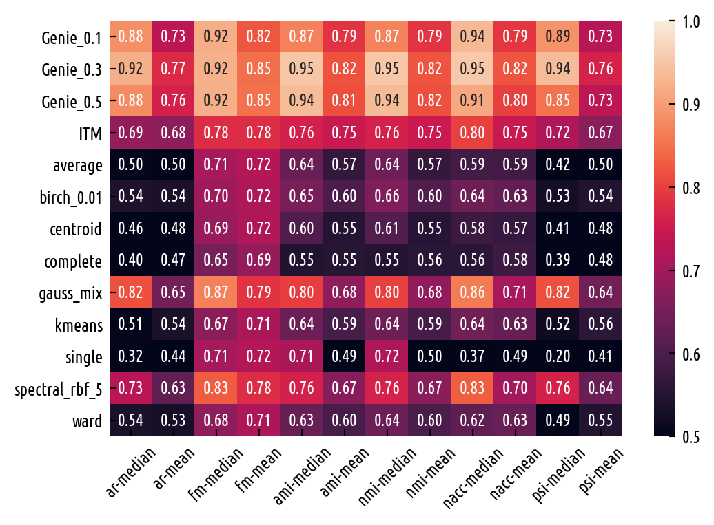
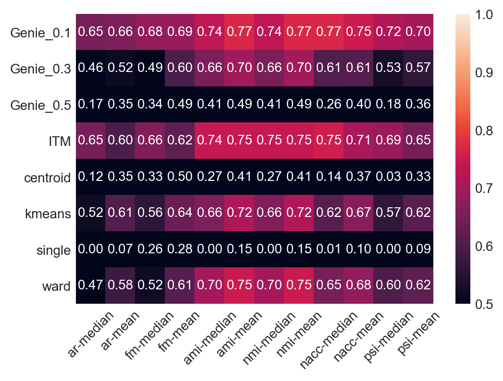

Benchmarks — Detailed Results
=============================

In one of the :any:`above sections <benchmarks_ar>`
2e have summarised the AR indices based on the datasets from
the `Benchmark Suite for Clustering Algorithms – Version 1 <https://github.com/gagolews/clustering_benchmarks_v1>`_ above.
In this section we present raw and more detailed results for
some other partition similarity measures implemented in the `genieclust`
package — adjusted Rand, Fowlkes-Mallows, adjusted and normalised mutual
information, normalised accuracy (purity) and pair sets index, see the API
documentation of :mod:`genieclust.compare_partitions` for more details.
In each case, score of 1.0 denotes perfect agreement between the clustering
results and the reference partitions.

At the preprocessing stage, features with variance of 0 were removed.
Every dataset has been centred at **0** and scaled so that is has total
variance of 1. Then, a tiny bit of Gaussian noise has been added to each
item. Clustering is performed with respect to the Euclidean distance
(wherever applicable).

Small Datasets
--------------

ar
^^

Summary statistics for ``ar`` (best=1.0):

==============  =======  ======  =====  =====  =====  =====  =====  =====
..                count    mean    std    min    25%    50%    75%    max
==============  =======  ======  =====  =====  =====  =====  =====  =====
Genie_0.1            73    0.73   0.31      0   0.53   0.88   1         1
Genie_0.3            73    0.77   0.28      0   0.59   0.92   1         1
Genie_0.5            73    0.76   0.31      0   0.56   0.88   1         1
ITM                  73    0.68   0.27      0   0.53   0.69   0.99      1
average              73    0.5    0.38      0   0.11   0.5    0.92      1
birch_0.01           73    0.54   0.35      0   0.19   0.54   0.9       1
centroid             73    0.48   0.38      0   0.08   0.46   0.92      1
complete             73    0.47   0.34      0   0.21   0.4    0.78      1
gauss_mix            73    0.65   0.37      0   0.4    0.82   0.98      1
kmeans               73    0.54   0.35      0   0.2    0.51   0.89      1
single               73    0.44   0.45      0   0      0.32   1         1
spectral_rbf_5       72    0.63   0.37      0   0.33   0.73   0.99      1
ward                 73    0.53   0.34      0   0.19   0.54   0.91      1
==============  =======  ======  =====  =====  =====  =====  =====  ===== 

Ranks for ``ar`` (best=1):

==============  =======  ======  =====  =====  =====  =====  =====  =====
..                count    mean    std    min    25%    50%    75%    max
==============  =======  ======  =====  =====  =====  =====  =====  =====
Genie_0.1            73     3.8    3.6      1      1      3      5     13
Genie_0.3            73     3.5    3.3      1      1      2      5     12
Genie_0.5            73     4.4    4.1      1      1      2      8     12
ITM                  73     5.5    4.3      1      1      5      9     13
average              73     6.9    3.6      1      5      7     10     13
birch_0.01           73     6.1    3.1      1      4      6      8     13
centroid             73     7.1    3.7      1      5      8     10     13
complete             73     8.3    3.4      1      6      9     11     13
gauss_mix            73     4.3    3.8      1      1      2      6     13
kmeans               73     6      4        1      1      6      9     13
single               73     7.9    5.5      1      1     11     13     13
spectral_rbf_5       73     5.4    3.7      1      1      6      8     13
ward                 73     6.4    3.2      1      4      7      8     13
==============  =======  ======  =====  =====  =====  =====  =====  ===== 

Raw results for ``ar`` (best=1.0):

======================  ===========  ===========  ===========  =====  =========  ============  ==========  ==========  ===========  ========  ========  ================  ======
..                        Genie_0.1    Genie_0.3    Genie_0.5    ITM    average    birch_0.01    centroid    complete    gauss_mix    kmeans    single    spectral_rbf_5    ward
======================  ===========  ===========  ===========  =====  =========  ============  ==========  ==========  ===========  ========  ========  ================  ======
fcps/atom                      1            1            1      1          0.1           0.1         0           0.08         0.03      0.18      1                 1       0.1
fcps/chainlink                 1            1            1      1          0.27          0.28        0.4         0.31         0.91      0.09      1                 1       0.28
fcps/engytime                  0.84         0.84         0.84   0.83       0.05          0.78        0.03        0.04         0.98      0.85      0                 0.92    0.75
fcps/hepta                     1            1            1      0.9        1             1           1           1            1         1         1                 1       1
fcps/lsun                      1            1            1      1          0.36          0.4         0.36        0.4          1         0.44      1                 0.8     0.37
fcps/target                    1            1            1      1          0.15          0.64        0.09        0.21         0.65      0.63      1                 1       0.64
fcps/tetra                     1            1            1      1          0.99          0.97        1           0.99         1         1         0                 1       0.97
fcps/twodiamonds               0.98         0.98         0.98   0.99       0.99          0.99        0.99        0.99         1         1         0                 1       1
fcps/wingnut                   1            1            1      1          1             1           1           1            0.86      0.86      1                 0.78    0.6
graves/dense                   0.96         0.96         0.96   1          0.92          0.92        0.92        0.26         1         0.81      0                 0.92    0.92
graves/fuzzyx                  0.64         0.35         0.39   0.89       0.74          0.78        0.68        0.77         0.89      0.93      0                 0.44    0.64
graves/line                    0.02         1            1      0.12       0             0           0           0            1         0         1                 1       0
graves/parabolic               0.81         0.81         0.81   0.64       0.6           0.57        0.66        0.59         0.54      0.59      0                 0.66    0.62
graves/ring                    1            1            1      1          0.11          0.12        0.05        0.21         0.03      0         1                 1       0.12
graves/ring_noisy              1            1            1      1          0             0.11        0           0.27         0.02      0.16      0                 1       0.15
graves/ring_outliers           1            1            1      1          0.63          0.63        0.35        0.34         0.62      0.62      1                 1       0.63
graves/zigzag                  1            1            1      0.78       0.53          0.62        0.46        0.36         0.96      0.53      1                 0.68    0.54
graves/zigzag_noisy            0.77         1            1      0.54       0.52          0.64        0.54        0.52         0.9       0.51      0.47              0.63    0.66
graves/zigzag_outliers         1            1            1      0.83       0.31          0.51        0.3         0.33         0.98      0.44      0.48              0.34    0.39
other/chameleon_t4_8k          0.83         1            0.93   0.84       0.64          0.62        0.72        0.55         0.56      0.6       0                 0.63    0.61
other/chameleon_t5_8k          1            1            0.83   0.59       1             1           1           0.73         1         1         0                 1       1
other/chameleon_t7_10k         0.53         0.7          1      0.53       0.45          0.44        0.47        0.37         0.4       0.42      0                 0.38    0.43
other/chameleon_t8_8k          0.61         0.64         0.71   0.57       0.37          0.39        0.37        0.33         0.44      0.37      0                 0.36    0.37
other/hdbscan                  0.97         0.71         0.71   0.75       0.43          0.63        0.41        0.46         0.82      0.64      0                 0.33    0.84
other/iris                     0.89         0.89         0.56   0.89       0.76          0.73        0.76        0.64         0.9       0.73      0.56              0.75    0.73
other/iris5                    0.59         0.59         0.79   0.52       0.56          0.51        0.56        0.34         0.82      0.51      0.15              0.53    0.51
other/square                   1            1            1      1          0.15          0           0.25        0.17         0.04      0.03      1                 0.17    0.25
sipu/a1                        0.94         0.9          0.83   0.77       0.93          0.93        0.94        0.92         0.96      0.97      0.44              0.94    0.91
sipu/a2                        0.95         0.92         0.83   0.77       0.93          0.94        0.94        0.91         0.96      0.97      0.35              0.91    0.92
sipu/a3                        0.96         0.94         0.82   0.77       0.94          0.94        0.93        0.92         0.95      0.95      0.32              0.93    0.94
sipu/aggregation               0.48         0.57         0.88   0.61       1             0.82        0.99        0.78         1         0.76      0.8               0.99    0.81
sipu/compound                  0.78         0.78         0.88   0.62       0.91          0.88        0.9         0.91         0.91      0.76      0.93              0.87    0.88
sipu/d31                       0.94         0.9          0.71   0.8        0.91          0.93        0.91        0.92         0.95      0.95      0.17              0.94    0.92
sipu/flame                     1            1            1      0.35       0.44          0.22        0.01        0            0.34      0.48      0.01              0.83    0.22
sipu/jain                      0.04         1            1      0.32       0.78          0.51        0.51        0.78         0         0.32      0.26              0.51    0.51
sipu/pathbased                 0.97         0.97         0.7    0.54       0.59          0.54        0.6         0.41         0.6       0.5       0                 0.6     0.54
sipu/r15                       0.99         0.99         1      0.99       1             1           1           1            1         1         1                 1       1
sipu/s1                        0.99         0.99         0.99   0.76       0.98          0.99        0.98        0.97         0.99      0.99      0.46              0.99    0.98
sipu/s2                        0.92         0.92         0.78   0.77       0.91          0.9         0.87        0.79         0.94      0.94      0                 0.94    0.91
sipu/s3                        0.69         0.67         0.56   0.61       0.6           0.68        0.57        0.51         0.73      0.72      0                 0.71    0.68
sipu/s4                        0.62         0.59         0.47   0.55       0.49          0.56        0.47        0.44         0.64      0.63      0                 0.57    0.55
sipu/spiral                    1            1            1      0.73       0             0           0           0            0         0         1                 0       0
sipu/unbalance                 0.57         0.62         0.78   0.53       1             1           1           0.61         1         1         1                 1       1
uci/ecoli                      0.36         0.46         0.66   0.33       0.74          0.49        0.46        0.62         0.61      0.46      0.04              0.35    0.49
uci/glass                      0.12         0.25         0.22   0.23       0.02          0.25        0.01        0.23         0.24      0.27      0.01              0.22    0.26
uci/ionosphere                 0.21         0.21         0      0.09       0             0.19        0           0.01         0.4       0.18      0                 0       0.19
uci/sonar                      0            0            0.01   0          0.01          0           0           0            0         0.01      0                 0       0
uci/statlog                    0.62         0.52         0.47   0.53       0             0.33        0           0.1          0.47      0.36      0               nan       0.31
uci/wdbc                       0.09         0.28         0.28   0.63       0.05          0.29        0.05        0.05         0.71      0.49      0                 0       0.29
uci/wine                       0.36         0.36         0.25   0.39       0.29          0.37        0.29        0.37         0.82      0.37      0.01              0.32    0.37
uci/yeast                      0.11         0.18         0.08   0.08       0.01          0.12        0.01        0.09         0.05      0.14      0.01              0.01    0.13
wut/circles                    1            1            1      1          1             1           1           1            1         1         1                 1       1
wut/cross                      0.76         0.46         0.1    0.53       0             0.02        0           0.36         0.47      0.11      0                 0       0.07
wut/graph                      0.48         0.49         0.39   0.52       0.41          0.44        0.41        0.4          0.86      0.44      0.03              0.41    0.46
wut/isolation                  1            1            1      1          0             0           0           0            0         0         1                 0       0
wut/labirynth                  0.5          0.59         0.72   0.72       0.36          0.49        0.3         0.3          0.62      0.29      0.76              0.39    0.34
wut/mk1                        0.99         0.99         0.99   0.53       0.99          0.99        0.99        0.97         0.99      0.99      0.56              0.99    0.99
wut/mk2                        1            1            1      1          0             0.01        0           0.01         0.01      0.01      1                 0       0
wut/mk3                        0.8          0.8          0.56   0.54       0.56          0.85        0.56        0.84         0.88      0.89      0                 0.88    0.86
wut/mk4                        1            1            1      0.59       0.04          0.14        0.08        0.28         0.5       0.2       1                 0.2     0.19
wut/olympic                    0.17         0.15         0.09   0.21       0.14          0.15        0.15        0.12         0.14      0.11      0                 0.13    0.13
wut/smile                      0.64         1            1      0.62       0.99          0.61        0.99        0.77         0.61      0.61      1                 1       0.65
wut/stripes                    1            1            1      1          0             0           0.03        0.01         0.01      0.01      1                 0.01    0.01
wut/trajectories               1            1            1      1          1             1           1           0.71         1         1         1                 1       1
wut/trapped_lovers             0.39         1            1      0.39       0.13          0.14        0.14        0.25         0.14      0.15      1                 0.75    0.16
wut/twosplashes                0.5          0.5          0.5    0.73       0             0.28        0           0.22         0.67      0.28      0                 0.28    0.19
wut/windows                    0.14         0.2          1      0.35       0.1           0.1         0.08        0.09         0.14      0.09      1                 0.15    0.1
wut/x1                         1            1            1      1          1             1           1           1            1         1         1                 1       1
wut/x2                         0.69         0.69         0.21   0.69       0.25          0.19        0.25        0.21         0.69      0.21      0                 0.27    0.19
wut/x3                         0.88         0.5          0.5    0.65       0.5           0.87        0.5         0.47         0.9       0.86      0.01              0.51    0.92
wut/z1                         0.39         0.39         0.14   0.39       0.21          0.1         0.14        0.19         0.01      0.2       0                 0.15    0.1
wut/z2                         0.5          0.63         0.82   0.49       0.51          0.5         0.51        0.44         1         0.47      0.73              0.99    0.43
wut/z3                         0.63         0.66         0.92   0.65       1             1           1           0.93         1         1         0.74              0.98    1
======================  ===========  ===========  ===========  =====  =========  ============  ==========  ==========  ===========  ========  ========  ================  ====== 

fm
^^

Summary statistics for ``fm`` (best=1.0):

==============  =======  ======  =====  =====  =====  =====  =====  =====
..                count    mean    std    min    25%    50%    75%    max
==============  =======  ======  =====  =====  =====  =====  =====  =====
Genie_0.1            73    0.82   0.2    0.25   0.66   0.92   1         1
Genie_0.3            73    0.85   0.18   0.37   0.7    0.92   1         1
Genie_0.5            73    0.85   0.18   0.36   0.75   0.92   1         1
ITM                  73    0.78   0.18   0.23   0.65   0.78   0.99      1
average              73    0.72   0.2    0.34   0.55   0.71   0.94      1
birch_0.01           73    0.72   0.21   0.28   0.54   0.7    0.92      1
centroid             73    0.72   0.2    0.34   0.56   0.69   0.94      1
complete             73    0.69   0.19   0.3    0.55   0.65   0.86      1
gauss_mix            73    0.79   0.22   0.26   0.66   0.87   0.98      1
kmeans               73    0.71   0.21   0.29   0.51   0.67   0.93      1
single               73    0.72   0.24   0.26   0.51   0.71   1         1
spectral_rbf_5       72    0.78   0.21   0.33   0.61   0.83   0.99      1
ward                 73    0.71   0.21   0.29   0.55   0.68   0.92      1
==============  =======  ======  =====  =====  =====  =====  =====  ===== 

Ranks for ``fm`` (best=1):

==============  =======  ======  =====  =====  =====  =====  =====  =====
..                count    mean    std    min    25%    50%    75%    max
==============  =======  ======  =====  =====  =====  =====  =====  =====
Genie_0.1            73     4.2    4        1      1      3      7     13
Genie_0.3            73     3.8    3.5      1      1      2      6     12
Genie_0.5            73     4.2    3.9      1      1      2      8     13
ITM                  73     6.1    4.7      1      1      5     11     13
average              73     6.2    3.4      1      4      6      9     12
birch_0.01           73     6.5    3.2      1      5      7      9     13
centroid             73     6.2    3.5      1      3      6      9     13
complete             73     8.5    3.6      1      7      9     12     13
gauss_mix            73     4.7    4        1      1      3      9     13
kmeans               73     6.9    4.3      1      2      9     10     13
single               73     6.5    5.3      1      1      6     13     13
spectral_rbf_5       73     5.2    3.7      1      1      5      8     13
ward                 73     6.9    3.4      1      5      7      9     13
==============  =======  ======  =====  =====  =====  =====  =====  ===== 

Raw results for ``fm`` (best=1.0):

======================  ===========  ===========  ===========  =====  =========  ============  ==========  ==========  ===========  ========  ========  ================  ======
..                        Genie_0.1    Genie_0.3    Genie_0.5    ITM    average    birch_0.01    centroid    complete    gauss_mix    kmeans    single    spectral_rbf_5    ward
======================  ===========  ===========  ===========  =====  =========  ============  ==========  ==========  ===========  ========  ========  ================  ======
fcps/atom                      1            1            1      1          0.65          0.65        0.69        0.65         0.66      0.65      1                 1       0.65
fcps/chainlink                 1            1            1      1          0.68          0.68        0.72        0.69         0.95      0.55      1                 1       0.68
fcps/engytime                  0.92         0.92         0.92   0.92       0.65          0.89        0.66        0.65         0.99      0.92      0.71              0.96    0.87
fcps/hepta                     1            1            1      0.91       1             1           1           1            1         1         1                 1       1
fcps/lsun                      1            1            1      1          0.6           0.63        0.6         0.63         1         0.65      1                 0.88    0.61
fcps/target                    1            1            1      1          0.71          0.8         0.71        0.71         0.8       0.79      1                 1       0.79
fcps/tetra                     1            1            1      1          0.99          0.98        1           0.99         1         1         0.49              1       0.98
fcps/twodiamonds               0.99         0.99         0.99   0.99       1             1           1           0.99         1         1         0.71              1       1
fcps/wingnut                   1            1            1      1          1             1           1           1            0.93      0.93      1                 0.89    0.8
graves/dense                   0.98         0.98         0.98   1          0.96          0.96        0.96        0.67         1         0.9       0.69              0.96    0.96
graves/fuzzyx                  0.72         0.7          0.7    0.94       0.8           0.84        0.75        0.87         0.91      0.96      0.72              0.69    0.8
graves/line                    0.6          1            1      0.63       0.6           0.6         0.6         0.61         1         0.6       1                 1       0.64
graves/parabolic               0.91         0.91         0.91   0.82       0.8           0.79        0.83        0.8          0.77      0.79      0.71              0.83    0.81
graves/ring                    1            1            1      1          0.65          0.65        0.65        0.66         0.66      0.5       1                 1       0.65
graves/ring_noisy              1            1            1      1          0.71          0.65        0.71        0.68         0.66      0.65      0.71              1       0.65
graves/ring_outliers           1            1            1      1          0.78          0.78        0.65        0.65         0.78      0.78      1                 1       0.78
graves/zigzag                  1            1            1      0.82       0.63          0.7         0.59        0.53         0.97      0.64      1                 0.75    0.64
graves/zigzag_noisy            0.82         1            1      0.63       0.62          0.71        0.64        0.63         0.92      0.62      0.67              0.72    0.73
graves/zigzag_outliers         1            1            1      0.86       0.55          0.61        0.55        0.52         0.98      0.59      0.67              0.66    0.58
other/chameleon_t4_8k          0.86         1            0.94   0.87       0.72          0.69        0.78        0.63         0.64      0.67      0.44              0.69    0.68
other/chameleon_t5_8k          1            1            0.87   0.67       1             1           1           0.78         1         1         0.41              1       1
other/chameleon_t7_10k         0.61         0.76         1      0.62       0.54          0.54        0.56        0.47         0.5       0.51      0.43              0.48    0.52
other/chameleon_t8_8k          0.68         0.7          0.77   0.64       0.47          0.49        0.47        0.43         0.53      0.46      0.41              0.46    0.47
other/hdbscan                  0.97         0.79         0.79   0.8        0.6           0.7         0.58        0.58         0.85      0.7       0.42              0.53    0.87
other/iris                     0.92         0.92         0.75   0.92       0.84          0.82        0.84        0.77         0.94      0.82      0.76              0.83    0.82
other/iris5                    0.76         0.76         0.89   0.72       0.77          0.74        0.77        0.67         0.9       0.73      0.69              0.75    0.74
other/square                   1            1            1      1          0.65          0.5         0.67        0.65         0.52      0.52      1                 0.65    0.67
sipu/a1                        0.94         0.9          0.85   0.78       0.93          0.94        0.94        0.92         0.96      0.97      0.56              0.94    0.92
sipu/a2                        0.95         0.92         0.84   0.78       0.94          0.94        0.94        0.91         0.96      0.97      0.48              0.91    0.92
sipu/a3                        0.96         0.94         0.84   0.77       0.94          0.94        0.94        0.92         0.95      0.95      0.45              0.93    0.94
sipu/aggregation               0.58         0.66         0.91   0.69       1             0.86        0.99        0.83         1         0.82      0.86              0.99    0.86
sipu/compound                  0.85         0.85         0.92   0.74       0.94          0.92        0.93        0.94         0.94      0.83      0.95              0.91    0.92
sipu/d31                       0.94         0.9          0.74   0.81       0.91          0.93        0.91        0.93         0.95      0.96      0.35              0.94    0.92
sipu/flame                     1            1            1      0.69       0.73          0.63        0.73        0.62         0.68      0.75      0.73              0.92    0.63
sipu/jain                      0.59         1            1      0.7        0.92          0.79        0.79        0.92         0.59      0.7       0.8               0.79    0.79
sipu/pathbased                 0.98         0.98         0.8    0.69       0.73          0.67        0.73        0.6          0.74      0.66      0.57              0.74    0.67
sipu/r15                       0.99         0.99         1      0.99       1             1           1           1            1         1         1                 1       1
sipu/s1                        0.99         0.99         0.99   0.77       0.98          0.99        0.98        0.97         0.99      0.99      0.59              0.99    0.98
sipu/s2                        0.92         0.92         0.8    0.78       0.92          0.91        0.88        0.81         0.95      0.94      0.26              0.94    0.91
sipu/s3                        0.71         0.69         0.61   0.64       0.64          0.7         0.62        0.55         0.75      0.74      0.26              0.73    0.7
sipu/s4                        0.64         0.62         0.53   0.58       0.55          0.59        0.53        0.49         0.67      0.66      0.26              0.61    0.58
sipu/spiral                    1            1            1      0.82       0.36          0.34        0.36        0.34         0.33      0.33      1                 0.33    0.34
sipu/unbalance                 0.69         0.73         0.84   0.66       1             1           1           0.77         1         1         1                 1       1
uci/ecoli                      0.51         0.59         0.75   0.48       0.82          0.61        0.68        0.72         0.71      0.59      0.53              0.62    0.61
uci/glass                      0.33         0.48         0.48   0.41       0.49          0.5         0.49        0.55         0.47      0.51      0.51              0.47    0.51
uci/ionosphere                 0.64         0.64         0.64   0.56       0.73          0.61        0.73        0.73         0.71      0.61      0.73              0.73    0.61
uci/sonar                      0.52         0.52         0.64   0.51       0.65          0.53        0.69        0.53         0.51      0.5       0.7               0.7     0.53
uci/statlog                    0.68         0.6          0.58   0.6        0.37          0.47        0.38        0.43         0.57      0.48      0.38            nan       0.45
uci/wdbc                       0.6          0.74         0.74   0.82       0.72          0.74        0.72        0.72         0.87      0.79      0.73              0.73    0.74
uci/wine                       0.58         0.58         0.59   0.6        0.62          0.58        0.62        0.59         0.88      0.58      0.56              0.63    0.58
uci/yeast                      0.25         0.39         0.39   0.23       0.46          0.28        0.47        0.42         0.26      0.3       0.47              0.47    0.29
wut/circles                    1            1            1      1          1             1           1           1            1         1         1                 1       1
wut/cross                      0.82         0.62         0.44   0.67       0.49          0.45        0.49        0.6          0.64      0.44      0.5               0.5     0.44
wut/graph                      0.54         0.55         0.49   0.57       0.49          0.51        0.49        0.48         0.88      0.51      0.31              0.49    0.53
wut/isolation                  1            1            1      1          0.34          0.35        0.35        0.34         0.33      0.33      1                 0.33    0.34
wut/labirynth                  0.62         0.69         0.79   0.79       0.51          0.61        0.47        0.46         0.72      0.45      0.85              0.53    0.49
wut/mk1                        0.99         0.99         0.99   0.7        0.99          0.99        0.99        0.98         0.99      0.99      0.77              0.99    0.99
wut/mk2                        1            1            1      1          0.5           0.51        0.51        0.5          0.5       0.5       1                 0.5     0.51
wut/mk3                        0.86         0.86         0.75   0.7        0.77          0.9         0.77        0.9          0.92      0.93      0.57              0.92    0.91
wut/mk4                        1            1            1      0.73       0.49          0.49        0.48        0.55         0.67      0.5       1                 0.51    0.5
wut/olympic                    0.37         0.37         0.36   0.38       0.35          0.33        0.34        0.3          0.32      0.29      0.45              0.33    0.31
wut/smile                      0.75         1            1      0.72       0.99          0.73        0.99        0.86         0.73      0.73      1                 1       0.76
wut/stripes                    1            1            1      1          0.51          0.54        0.51        0.53         0.51      0.51      1                 0.51    0.55
wut/trajectories               1            1            1      1          1             1           1           0.8          1         1         1                 1       1
wut/trapped_lovers             0.64         1            1      0.64       0.5           0.5         0.52        0.54         0.5       0.5       1                 0.86    0.5
wut/twosplashes                0.75         0.75         0.75   0.87       0.69          0.64        0.69        0.61         0.84      0.64      0.7               0.64    0.6
wut/windows                    0.43         0.5          1      0.58       0.39          0.39        0.38        0.39         0.41      0.37      1                 0.43    0.4
wut/x1                         1            1            1      1          1             1           1           1            1         1         1                 1       1
wut/x2                         0.8          0.8          0.55   0.79       0.59          0.54        0.59        0.55         0.8       0.55      0.57              0.6     0.54
wut/x3                         0.91         0.67         0.67   0.76       0.68          0.9         0.68        0.62         0.93      0.89      0.51              0.69    0.94
wut/z1                         0.6          0.6          0.5    0.6        0.51          0.42        0.48        0.46         0.36      0.47      0.55              0.43    0.42
wut/z2                         0.66         0.76         0.89   0.65       0.68          0.66        0.67        0.62         1         0.64      0.86              0.99    0.61
wut/z3                         0.74         0.77         0.94   0.74       1             1           1           0.95         1         1         0.84              0.99    1
======================  ===========  ===========  ===========  =====  =========  ============  ==========  ==========  ===========  ========  ========  ================  ====== 

ami
^^^

Summary statistics for ``ami`` (best=1.0):

==============  =======  ======  =====  =====  =====  =====  =====  =====
..                count    mean    std    min    25%    50%    75%    max
==============  =======  ======  =====  =====  =====  =====  =====  =====
Genie_0.1            73    0.79   0.26   0      0.71   0.87   1         1
Genie_0.3            73    0.82   0.24   0      0.74   0.95   1         1
Genie_0.5            73    0.81   0.26   0.06   0.7    0.94   1         1
ITM                  73    0.75   0.24   0      0.63   0.76   0.97      1
average              73    0.57   0.36   0      0.27   0.64   0.95      1
birch_0.01           73    0.6    0.33   0      0.34   0.65   0.92      1
centroid             73    0.55   0.36   0      0.18   0.6    0.95      1
complete             73    0.55   0.31   0      0.35   0.55   0.83      1
gauss_mix            73    0.68   0.34   0      0.43   0.8    0.97      1
kmeans               73    0.59   0.33   0      0.36   0.64   0.88      1
single               73    0.49   0.46   0      0      0.71   1         1
spectral_rbf_5       72    0.67   0.34   0      0.47   0.76   0.99      1
ward                 73    0.6    0.32   0      0.35   0.63   0.91      1
==============  =======  ======  =====  =====  =====  =====  =====  ===== 

Ranks for ``ami`` (best=1):

==============  =======  ======  =====  =====  =====  =====  =====  =====
..                count    mean    std    min    25%    50%    75%    max
==============  =======  ======  =====  =====  =====  =====  =====  =====
Genie_0.1            73     3.7    3.5      1      1      2      5     13
Genie_0.3            73     3.2    3.2      1      1      1      4     12
Genie_0.5            73     4.1    3.9      1      1      1      8     13
ITM                  73     5.9    4.2      1      2      5     10     13
average              73     6.8    3.7      1      4      7     10     13
birch_0.01           73     6      3.2      1      4      6      8     13
centroid             73     7      3.8      1      5      7     11     13
complete             73     8.3    3.4      1      6      9     11     13
gauss_mix            73     4.4    3.9      1      1      3      7     13
kmeans               73     6.1    4.1      1      1      6     10     13
single               73     8.1    5.4      1      1     11     13     13
spectral_rbf_5       73     5.2    3.7      1      1      5      9     13
ward                 73     6.3    3.3      1      4      7      9     13
==============  =======  ======  =====  =====  =====  =====  =====  ===== 

Raw results for ``ami`` (best=1.0):

======================  ===========  ===========  ===========  =====  =========  ============  ==========  ==========  ===========  ========  ========  ================  ======
..                        Genie_0.1    Genie_0.3    Genie_0.5    ITM    average    birch_0.01    centroid    complete    gauss_mix    kmeans    single    spectral_rbf_5    ward
======================  ===========  ===========  ===========  =====  =========  ============  ==========  ==========  ===========  ========  ========  ================  ======
fcps/atom                      1            1            1      1          0.22          0.22        0.04        0.2          0.13      0.29      1                 1       0.22
fcps/chainlink                 1            1            1      1          0.36          0.37        0.45        0.39         0.84      0.07      1                 1       0.37
fcps/engytime                  0.79         0.79         0.79   0.74       0.16          0.68        0.12        0.15         0.96      0.77      0                 0.87    0.68
fcps/hepta                     1            1            1      0.94       1             1           1           1            1         1         1                 1       1
fcps/lsun                      1            1            1      1          0.5           0.53        0.5         0.53         1         0.54      1                 0.82    0.51
fcps/target                    1            1            1      1          0.33          0.64        0.28        0.38         0.65      0.63      1                 1       0.63
fcps/tetra                     1            1            1      1          0.99          0.96        1           0.98         1         1         0                 1       0.96
fcps/twodiamonds               0.95         0.95         0.95   0.97       0.99          0.99        0.99        0.97         1         1         0                 1       1
fcps/wingnut                   1            1            1      1          1             1           1           1            0.78      0.77      1                 0.68    0.49
graves/dense                   0.93         0.93         0.93   1          0.88          0.88        0.88        0.35         1         0.76      0.02              0.88    0.88
graves/fuzzyx                  0.74         0.59         0.58   0.84       0.8           0.83        0.77        0.79         0.89      0.88      0                 0.64    0.74
graves/line                    0.2          1            1      0.25       0.14          0.14        0.18        0.14         1         0.18      1                 1       0.1
graves/parabolic               0.74         0.74         0.74   0.54       0.49          0.57        0.55        0.51         0.43      0.48      0                 0.55    0.52
graves/ring                    1            1            1      1          0.23          0.24        0.16        0.31         0.13      0         1                 1       0.24
graves/ring_noisy              1            1            1      1          0             0.23        0           0.36         0.12      0.28      0                 1       0.26
graves/ring_outliers           1            1            1      1          0.65          0.65        0.41        0.41         0.65      0.65      1                 1       0.65
graves/zigzag                  1            1            1      0.85       0.67          0.76        0.63        0.56         0.96      0.71      1                 0.8     0.71
graves/zigzag_noisy            0.85         1            1      0.68       0.66          0.75        0.71        0.67         0.89      0.66      0.74              0.78    0.76
graves/zigzag_outliers         1            1            1      0.9        0.49          0.65        0.49        0.53         0.97      0.61      0.74              0.53    0.57
other/chameleon_t4_8k          0.91         1            0.95   0.87       0.76          0.73        0.81        0.62         0.69      0.7       0                 0.72    0.73
other/chameleon_t5_8k          1            1            0.93   0.75       1             1           1           0.83         1         1         0                 1       1
other/chameleon_t7_10k         0.78         0.87         1      0.76       0.69          0.71        0.71        0.6          0.68      0.66      0                 0.64    0.69
other/chameleon_t8_8k          0.79         0.79         0.86   0.76       0.59          0.58        0.6         0.55         0.64      0.59      0                 0.58    0.59
other/hdbscan                  0.97         0.87         0.87   0.85       0.62          0.75        0.6         0.61         0.82      0.73      0                 0.55    0.86
other/iris                     0.87         0.87         0.7    0.87       0.8           0.77        0.8         0.72         0.9       0.76      0.71              0.8     0.77
other/iris5                    0.58         0.58         0.76   0.54       0.63          0.56        0.63        0.46         0.81      0.54      0.34              0.61    0.56
other/square                   1            1            1      1          0.27          0           0.34        0.28         0.03      0.02      1                 0.28    0.35
sipu/a1                        0.96         0.95         0.94   0.89       0.95          0.96        0.96        0.95         0.97      0.97      0.78              0.96    0.95
sipu/a2                        0.97         0.96         0.94   0.9        0.96          0.96        0.96        0.95         0.98      0.98      0.76              0.96    0.96
sipu/a3                        0.97         0.97         0.95   0.91       0.97          0.97        0.97        0.96         0.97      0.97      0.76              0.96    0.97
sipu/aggregation               0.7          0.76         0.92   0.78       1             0.92        0.99        0.9          1         0.88      0.88              0.99    0.92
sipu/compound                  0.85         0.85         0.88   0.74       0.93          0.88        0.91        0.93         0.93      0.83      0.93              0.86    0.88
sipu/d31                       0.96         0.95         0.9    0.91       0.95          0.95        0.95        0.95         0.96      0.97      0.63              0.96    0.95
sipu/flame                     1            1            1      0.43       0.48          0.35        0.02        0.12         0.42      0.43      0.02              0.73    0.35
sipu/jain                      0.23         1            1      0.39       0.7           0.5         0.5         0.7          0.2       0.37      0.24              0.5     0.5
sipu/pathbased                 0.95         0.95         0.81   0.61       0.64          0.59        0.65        0.5          0.66      0.58      0                 0.67    0.59
sipu/r15                       0.99         0.99         1      0.99       1             1           1           1            1         1         1                 1       1
sipu/s1                        0.99         0.99         0.99   0.88       0.98          0.99        0.98        0.98         0.99      0.99      0.79              0.99    0.98
sipu/s2                        0.93         0.93         0.91   0.86       0.93          0.92        0.93        0.88         0.95      0.95      0                 0.94    0.93
sipu/s3                        0.78         0.77         0.75   0.74       0.75          0.77        0.74        0.7          0.8       0.79      0                 0.79    0.77
sipu/s4                        0.71         0.7          0.66   0.68       0.66          0.69        0.65        0.63         0.73      0.72      0                 0.71    0.69
sipu/spiral                    1            1            1      0.78       0             0           0           0            0         0         1                 0       0
sipu/unbalance                 0.75         0.77         0.82   0.75       1             1           1           0.82         1         1         0.99              1       1
uci/ecoli                      0.49         0.54         0.57   0.49       0.71          0.62        0.54        0.64         0.57      0.58      0.11              0.48    0.62
uci/glass                      0.25         0.38         0.34   0.33       0.07          0.34        0.05        0.35         0.33      0.4       0.03              0.31    0.37
uci/ionosphere                 0.13         0.13         0.06   0.09       0             0.14        0           0.01         0.32      0.13      0                 0       0.14
uci/sonar                      0            0            0.07   0          0             0           0.04        0            0         0.01      0                 0       0
uci/statlog                    0.68         0.68         0.7    0.63       0.01          0.53        0           0.35         0.61      0.52      0               nan       0.49
uci/wdbc                       0.24         0.31         0.31   0.51       0.09          0.32        0.09        0.09         0.61      0.46      0                 0       0.32
uci/wine                       0.41         0.41         0.38   0.37       0.4           0.41        0.4         0.44         0.82      0.42      0.04              0.42    0.41
uci/yeast                      0.22         0.25         0.19   0.19       0.05          0.22        0.05        0.18         0.14      0.26      0.05              0.06    0.23
wut/circles                    1            1            1      1          1             1           1           1            1         1         1                 1       1
wut/cross                      0.81         0.62         0.36   0.7        0.04          0.18        0.04        0.48         0.61      0.36      0                 0.01    0.31
wut/graph                      0.68         0.69         0.62   0.69       0.62          0.63        0.63        0.6          0.89      0.64      0.23              0.62    0.65
wut/isolation                  1            1            1      1          0             0           0           0            0         0         1                 0       0
wut/labirynth                  0.71         0.78         0.88   0.87       0.59          0.71        0.53        0.54         0.76      0.5       0.85              0.6     0.58
wut/mk1                        0.98         0.98         0.98   0.61       0.98          0.98        0.98        0.95         0.98      0.98      0.72              0.98    0.98
wut/mk2                        1            1            1      1          0             0.01        0           0.01         0         0.01      1                 0       0
wut/mk3                        0.8          0.8          0.69   0.61       0.71          0.83        0.71        0.83         0.85      0.86      0                 0.85    0.84
wut/mk4                        1            1            1      0.65       0.11          0.2         0.15        0.3          0.58      0.25      1                 0.25    0.24
wut/olympic                    0.33         0.33         0.31   0.31       0.31          0.27        0.29        0.21         0.25      0.2       0                 0.31    0.23
wut/smile                      0.8          1            1      0.85       0.98          0.79        0.98        0.83         0.79      0.79      1                 1       0.8
wut/stripes                    1            1            1      1          0             0           0.02        0.01         0.01      0.01      1                 0.01    0.01
wut/trajectories               1            1            1      1          1             1           1           0.83         1         1         1                 1       1
wut/trapped_lovers             0.62         1            1      0.62       0.35          0.36        0.35        0.45         0.36      0.38      1                 0.74    0.39
wut/twosplashes                0.4          0.4          0.4    0.69       0.04          0.21        0.04        0.17         0.56      0.21      0.01              0.21    0.15
wut/windows                    0.48         0.56         1      0.65       0.4           0.4         0.38        0.4          0.43      0.35      1                 0.43    0.4
wut/x1                         1            1            1      1          1             1           1           1            1         1         1                 1       1
wut/x2                         0.75         0.75         0.39   0.71       0.4           0.38        0.4         0.39         0.75      0.39      0                 0.41    0.38
wut/x3                         0.87         0.66         0.66   0.69       0.66          0.87        0.66        0.63         0.89      0.87      0.01              0.68    0.91
wut/z1                         0.47         0.47         0.24   0.46       0.32          0.13        0.28        0.26         0.03      0.27      0.05              0.19    0.13
wut/z2                         0.72         0.74         0.86   0.71       0.72          0.72        0.72        0.64         1         0.68      0.81              0.98    0.69
wut/z3                         0.74         0.74         0.91   0.75       0.99          0.99        0.99        0.93         0.99      1         0.84              0.97    1
======================  ===========  ===========  ===========  =====  =========  ============  ==========  ==========  ===========  ========  ========  ================  ====== 

nmi
^^^

Summary statistics for ``nmi`` (best=1.0):

==============  =======  ======  =====  =====  =====  =====  =====  =====
..                count    mean    std    min    25%    50%    75%    max
==============  =======  ======  =====  =====  =====  =====  =====  =====
Genie_0.1            73    0.79   0.26   0      0.71   0.87   1         1
Genie_0.3            73    0.82   0.24   0      0.74   0.95   1         1
Genie_0.5            73    0.82   0.26   0.07   0.71   0.94   1         1
ITM                  73    0.75   0.24   0.01   0.63   0.76   0.97      1
average              73    0.57   0.35   0      0.27   0.64   0.95      1
birch_0.01           73    0.6    0.33   0      0.35   0.66   0.92      1
centroid             73    0.55   0.36   0      0.18   0.61   0.95      1
complete             73    0.56   0.31   0      0.35   0.55   0.83      1
gauss_mix            73    0.68   0.34   0      0.43   0.8    0.98      1
kmeans               73    0.59   0.32   0      0.37   0.64   0.88      1
single               73    0.5    0.45   0      0.01   0.72   1         1
spectral_rbf_5       72    0.67   0.34   0      0.49   0.76   0.99      1
ward                 73    0.6    0.32   0      0.35   0.64   0.91      1
==============  =======  ======  =====  =====  =====  =====  =====  ===== 

Ranks for ``nmi`` (best=1):

==============  =======  ======  =====  =====  =====  =====  =====  =====
..                count    mean    std    min    25%    50%    75%    max
==============  =======  ======  =====  =====  =====  =====  =====  =====
Genie_0.1            73     3.8    3.6      1      1      2      5     13
Genie_0.3            73     3.3    3.2      1      1      1      4     12
Genie_0.5            73     4.1    3.9      1      1      1      8     13
ITM                  73     5.8    4.2      1      1      5     10     13
average              73     6.9    3.7      1      4      7     10     13
birch_0.01           73     6.2    3.2      1      4      6      8     13
centroid             73     7      3.8      1      5      6     11     13
complete             73     8.4    3.4      1      6      9     11     13
gauss_mix            73     4.5    4        1      1      3      7     13
kmeans               73     6.2    4.2      1      1      6     10     13
single               73     8.1    5.4      1      1     11     13     13
spectral_rbf_5       73     5.2    3.7      1      1      5      8     13
ward                 73     6.5    3.3      1      4      7      9     13
==============  =======  ======  =====  =====  =====  =====  =====  ===== 

Raw results for ``nmi`` (best=1.0):

======================  ===========  ===========  ===========  =====  =========  ============  ==========  ==========  ===========  ========  ========  ================  ======
..                        Genie_0.1    Genie_0.3    Genie_0.5    ITM    average    birch_0.01    centroid    complete    gauss_mix    kmeans    single    spectral_rbf_5    ward
======================  ===========  ===========  ===========  =====  =========  ============  ==========  ==========  ===========  ========  ========  ================  ======
fcps/atom                      1            1            1      1          0.22          0.22        0.04        0.2          0.13      0.29      1                 1       0.22
fcps/chainlink                 1            1            1      1          0.36          0.37        0.45        0.39         0.84      0.07      1                 1       0.37
fcps/engytime                  0.79         0.79         0.79   0.74       0.16          0.68        0.12        0.15         0.96      0.77      0                 0.87    0.68
fcps/hepta                     1            1            1      0.95       1             1           1           1            1         1         1                 1       1
fcps/lsun                      1            1            1      1          0.5           0.53        0.5         0.53         1         0.54      1                 0.82    0.51
fcps/target                    1            1            1      1          0.34          0.64        0.28        0.38         0.65      0.64      1                 1       0.64
fcps/tetra                     1            1            1      1          0.99          0.96        1           0.98         1         1         0.01              1       0.96
fcps/twodiamonds               0.95         0.95         0.95   0.97       0.99          0.99        0.99        0.97         1         1         0                 1       1
fcps/wingnut                   1            1            1      1          1             1           1           1            0.78      0.77      1                 0.68    0.49
graves/dense                   0.93         0.93         0.93   1          0.88          0.88        0.88        0.35         1         0.76      0.03              0.88    0.88
graves/fuzzyx                  0.75         0.6          0.58   0.84       0.8           0.83        0.77        0.79         0.89      0.88      0.01              0.64    0.74
graves/line                    0.2          1            1      0.25       0.14          0.14        0.18        0.14         1         0.18      1                 1       0.1
graves/parabolic               0.74         0.74         0.74   0.54       0.49          0.57        0.55        0.51         0.43      0.48      0.01              0.55    0.52
graves/ring                    1            1            1      1          0.23          0.24        0.16        0.31         0.13      0         1                 1       0.24
graves/ring_noisy              1            1            1      1          0             0.24        0           0.36         0.12      0.28      0                 1       0.27
graves/ring_outliers           1            1            1      1          0.66          0.66        0.41        0.41         0.65      0.65      1                 1       0.66
graves/zigzag                  1            1            1      0.85       0.67          0.76        0.64        0.57         0.96      0.71      1                 0.81    0.71
graves/zigzag_noisy            0.85         1            1      0.68       0.67          0.76        0.71        0.68         0.89      0.67      0.74              0.79    0.77
graves/zigzag_outliers         1            1            1      0.9        0.5           0.66        0.5         0.54         0.98      0.62      0.74              0.53    0.57
other/chameleon_t4_8k          0.91         1            0.95   0.87       0.76          0.73        0.81        0.62         0.69      0.7       0                 0.72    0.73
other/chameleon_t5_8k          1            1            0.93   0.75       1             1           1           0.83         1         1         0                 1       1
other/chameleon_t7_10k         0.78         0.87         1      0.76       0.69          0.71        0.71        0.6          0.68      0.66      0                 0.64    0.69
other/chameleon_t8_8k          0.79         0.79         0.86   0.76       0.59          0.58        0.6         0.55         0.64      0.59      0                 0.58    0.59
other/hdbscan                  0.97         0.87         0.88   0.85       0.62          0.75        0.61        0.61         0.82      0.73      0                 0.55    0.86
other/iris                     0.87         0.87         0.71   0.87       0.81          0.77        0.81        0.72         0.9       0.76      0.72              0.8     0.77
other/iris5                    0.59         0.59         0.76   0.55       0.64          0.57        0.64        0.47         0.81      0.55      0.36              0.62    0.57
other/square                   1            1            1      1          0.27          0           0.34        0.28         0.03      0.02      1                 0.28    0.35
sipu/a1                        0.96         0.95         0.94   0.89       0.95          0.96        0.96        0.95         0.97      0.97      0.79              0.96    0.95
sipu/a2                        0.97         0.96         0.95   0.91       0.96          0.96        0.96        0.95         0.98      0.98      0.77              0.96    0.96
sipu/a3                        0.98         0.97         0.95   0.91       0.97          0.97        0.97        0.96         0.98      0.98      0.76              0.97    0.97
sipu/aggregation               0.71         0.76         0.92   0.78       1             0.92        0.99        0.9          1         0.88      0.88              0.99    0.92
sipu/compound                  0.85         0.85         0.89   0.75       0.93          0.88        0.92        0.93         0.93      0.83      0.93              0.86    0.88
sipu/d31                       0.96         0.95         0.91   0.91       0.95          0.96        0.95        0.95         0.96      0.97      0.64              0.96    0.95
sipu/flame                     1            1            1      0.43       0.48          0.35        0.02        0.13         0.42      0.43      0.02              0.73    0.35
sipu/jain                      0.23         1            1      0.39       0.7           0.51        0.51        0.7          0.2       0.37      0.25              0.51    0.51
sipu/pathbased                 0.95         0.95         0.81   0.61       0.64          0.6         0.66        0.51         0.66      0.59      0.02              0.67    0.6
sipu/r15                       0.99         0.99         1      0.99       1             1           1           1            1         1         1                 1       1
sipu/s1                        0.99         0.99         0.99   0.88       0.98          0.99        0.98        0.98         0.99      0.99      0.79              0.99    0.98
sipu/s2                        0.93         0.93         0.91   0.86       0.93          0.92        0.93        0.88         0.95      0.95      0.01              0.94    0.93
sipu/s3                        0.78         0.78         0.75   0.75       0.75          0.77        0.74        0.71         0.8       0.79      0.01              0.79    0.77
sipu/s4                        0.72         0.71         0.67   0.68       0.67          0.69        0.66        0.63         0.73      0.72      0.01              0.71    0.69
sipu/spiral                    1            1            1      0.79       0             0.01        0.01        0.01         0         0         1                 0       0.01
sipu/unbalance                 0.75         0.77         0.82   0.75       1             1           1           0.82         1         1         0.99              1       1
uci/ecoli                      0.51         0.56         0.59   0.51       0.72          0.63        0.56        0.65         0.59      0.6       0.15              0.51    0.63
uci/glass                      0.28         0.41         0.37   0.35       0.11          0.37        0.09        0.38         0.36      0.43      0.07              0.34    0.39
uci/ionosphere                 0.13         0.13         0.07   0.09       0.01          0.14        0.01        0.02         0.32      0.13      0.01              0.01    0.14
uci/sonar                      0            0            0.08   0.01       0.01          0           0.05        0            0.01      0.01      0.01              0.01    0
uci/statlog                    0.68         0.68         0.7    0.63       0.02          0.53        0.01        0.35         0.62      0.52      0.01            nan       0.49
uci/wdbc                       0.24         0.32         0.32   0.51       0.09          0.32        0.09        0.09         0.61      0.46      0.01              0.01    0.32
uci/wine                       0.42         0.42         0.39   0.38       0.4           0.42        0.4         0.44         0.82      0.43      0.06              0.43    0.42
uci/yeast                      0.23         0.27         0.2    0.2        0.07          0.23        0.07        0.19         0.15      0.27      0.07              0.07    0.24
wut/circles                    1            1            1      1          1             1           1           1            1         1         1                 1       1
wut/cross                      0.81         0.62         0.36   0.7        0.04          0.19        0.04        0.48         0.61      0.37      0                 0.01    0.31
wut/graph                      0.68         0.69         0.62   0.7        0.62          0.63        0.64        0.61         0.89      0.64      0.24              0.63    0.66
wut/isolation                  1            1            1      1          0             0           0           0            0         0         1                 0       0
wut/labirynth                  0.71         0.78         0.88   0.87       0.59          0.71        0.54        0.54         0.76      0.5       0.85              0.6     0.58
wut/mk1                        0.98         0.98         0.98   0.62       0.98          0.98        0.98        0.95         0.98      0.98      0.73              0.98    0.98
wut/mk2                        1            1            1      1          0             0.01        0           0.01         0.01      0.01      1                 0       0
wut/mk3                        0.8          0.8          0.69   0.61       0.71          0.83        0.71        0.83         0.85      0.86      0.01              0.85    0.84
wut/mk4                        1            1            1      0.65       0.12          0.2         0.15        0.3          0.58      0.25      1                 0.25    0.24
wut/olympic                    0.33         0.34         0.31   0.31       0.31          0.27        0.29        0.21         0.25      0.2       0                 0.31    0.23
wut/smile                      0.8          1            1      0.85       0.98          0.79        0.98        0.83         0.79      0.79      1                 1       0.81
wut/stripes                    1            1            1      1          0             0           0.02        0.01         0.01      0.01      1                 0.01    0.01
wut/trajectories               1            1            1      1          1             1           1           0.83         1         1         1                 1       1
wut/trapped_lovers             0.63         1            1      0.62       0.35          0.36        0.35        0.45         0.36      0.38      1                 0.74    0.39
wut/twosplashes                0.4          0.4          0.4    0.69       0.04          0.21        0.04        0.17         0.56      0.21      0.01              0.21    0.15
wut/windows                    0.48         0.56         1      0.65       0.41          0.41        0.38        0.4          0.43      0.35      1                 0.43    0.4
wut/x1                         1            1            1      1          1             1           1           1            1         1         1                 1       1
wut/x2                         0.75         0.75         0.4    0.71       0.41          0.39        0.41        0.4          0.75      0.4       0.03              0.43    0.39
wut/x3                         0.87         0.67         0.67   0.7        0.67          0.87        0.67        0.64         0.89      0.87      0.04              0.69    0.91
wut/z1                         0.47         0.47         0.24   0.47       0.33          0.14        0.29        0.27         0.04      0.27      0.07              0.19    0.14
wut/z2                         0.72         0.74         0.86   0.72       0.72          0.72        0.72        0.64         1         0.68      0.81              0.98    0.69
wut/z3                         0.74         0.75         0.91   0.75       0.99          0.99        0.99        0.93         0.99      1         0.84              0.97    1
======================  ===========  ===========  ===========  =====  =========  ============  ==========  ==========  ===========  ========  ========  ================  ====== 

nacc
^^^^

Summary statistics for ``nacc`` (best=1.0):

==============  =======  ======  =====  =====  =====  =====  =====  =====
..                count    mean    std    min    25%    50%    75%    max
==============  =======  ======  =====  =====  =====  =====  =====  =====
Genie_0.1            73    0.79   0.26   0.02   0.63   0.94   1         1
Genie_0.3            73    0.82   0.23   0.02   0.66   0.95   1         1
Genie_0.5            73    0.8    0.26   0.08   0.65   0.91   1         1
ITM                  73    0.75   0.23   0.08   0.6    0.8    0.99      1
average              73    0.59   0.34   0      0.32   0.59   0.96      1
birch_0.01           73    0.63   0.31   0.01   0.38   0.64   0.95      1
centroid             73    0.57   0.34   0      0.29   0.58   0.96      1
complete             73    0.58   0.3    0.02   0.38   0.56   0.84      1
gauss_mix            73    0.71   0.33   0.01   0.51   0.86   0.99      1
kmeans               73    0.63   0.3    0.01   0.4    0.64   0.94      1
single               73    0.49   0.42   0      0.09   0.37   1         1
spectral_rbf_5       72    0.7    0.32   0.01   0.42   0.83   1         1
ward                 73    0.63   0.29   0.02   0.4    0.62   0.95      1
==============  =======  ======  =====  =====  =====  =====  =====  ===== 

Ranks for ``nacc`` (best=1):

==============  =======  ======  =====  =====  =====  =====  =====  =====
..                count    mean    std    min    25%    50%    75%    max
==============  =======  ======  =====  =====  =====  =====  =====  =====
Genie_0.1            73     4      3.9      1      1      2      7     13
Genie_0.3            73     3.8    3.6      1      1      2      6     12
Genie_0.5            73     4.4    4.2      1      1      2      8     13
ITM                  73     5.6    4.3      1      1      5     10     13
average              73     6.6    3.9      1      3      8     10     13
birch_0.01           73     6.2    3.3      1      5      6      8     13
centroid             73     7.1    4        1      4      8     11     13
complete             73     8.2    3.2      1      7      9     11     13
gauss_mix            73     4.5    4.2      1      1      2      8     13
kmeans               73     6.1    4        1      1      7      9     13
single               73     8.1    5.5      1      1     11     13     13
spectral_rbf_5       73     5.4    3.8      1      1      5      8     13
ward                 73     6.5    3.4      1      4      7      9     13
==============  =======  ======  =====  =====  =====  =====  =====  ===== 

Raw results for ``nacc`` (best=1.0):

======================  ===========  ===========  ===========  =====  =========  ============  ==========  ==========  ===========  ========  ========  ================  ======
..                        Genie_0.1    Genie_0.3    Genie_0.5    ITM    average    birch_0.01    centroid    complete    gauss_mix    kmeans    single    spectral_rbf_5    ward
======================  ===========  ===========  ===========  =====  =========  ============  ==========  ==========  ===========  ========  ========  ================  ======
fcps/atom                      1            1            1      1          0.31          0.31        0.05        0.29         0.17      0.43      1                 1       0.31
fcps/chainlink                 1            1            1      1          0.52          0.53        0.64        0.56         0.95      0.31      1                 1       0.53
fcps/engytime                  0.92         0.92         0.92   0.91       0.23          0.88        0.17        0.2          0.99      0.92      0                 0.96    0.86
fcps/hepta                     1            1            1      0.94       1             1           1           1            1         1         1                 1       1
fcps/lsun                      1            1            1      1          0.58          0.62        0.58        0.62         1         0.65      1                 0.89    0.58
fcps/target                    1            1            1      1          0.6           0.6         0.53        0.66         0.58      0.55      1                 1       0.59
fcps/tetra                     1            1            1      1          1             0.98        1           0.99         1         1         0.01              1       0.98
fcps/twodiamonds               0.99         0.99         0.99   0.99       1             1           1           0.99         1         1         0                 1       1
fcps/wingnut                   1            1            1      1          1             1           1           1            0.93      0.93      1                 0.88    0.78
graves/dense                   0.98         0.98         0.98   1          0.96          0.96        0.96        0.51         1         0.9       0.03              0.96    0.96
graves/fuzzyx                  0.78         0.59         0.64   0.94       0.86          0.87        0.82        0.88         0.94      0.96      0.17              0.69    0.79
graves/line                    0.19         1            1      0.35       0.01          0.01        0.13        0.02         1         0.14      1                 1       0.19
graves/parabolic               0.9          0.9          0.9    0.8        0.77          0.76        0.81        0.77         0.73      0.77      0.1               0.81    0.79
graves/ring                    1            1            1      1          0.34          0.34        0.22        0.46         0.17      0.01      1                 1       0.34
graves/ring_noisy              1            1            1      1          0             0.34        0           0.52         0.16      0.4       0                 1       0.38
graves/ring_outliers           1            1            1      1          0.58          0.57        0.51        0.53         0.55      0.55      1                 1       0.58
graves/zigzag                  1            1            1      0.86       0.69          0.73        0.62        0.55         0.98      0.7       1                 0.81    0.63
graves/zigzag_noisy            0.88         1            1      0.67       0.65          0.77        0.65        0.58         0.95      0.64      0.5               0.78    0.79
graves/zigzag_outliers         1            1            1      0.89       0.34          0.53        0.34        0.46         0.99      0.51      0.53              0.4     0.42
other/chameleon_t4_8k          0.77         1            0.89   0.83       0.72          0.63        0.75        0.6          0.63      0.63      0.09              0.64    0.62
other/chameleon_t5_8k          1            1            0.82   0.69       1             1           1           0.79         1         1         0.01              1       1
other/chameleon_t7_10k         0.55         0.77         1      0.61       0.49          0.45        0.44        0.43         0.4       0.44      0.21              0.41    0.51
other/chameleon_t8_8k          0.6          0.6          0.79   0.58       0.41          0.46        0.43        0.39         0.51      0.4       0.09              0.4     0.4
other/hdbscan                  0.98         0.74         0.74   0.86       0.4           0.72        0.44        0.54         0.86      0.77      0.07              0.47    0.91
other/iris                     0.94         0.94         0.55   0.94       0.86          0.84        0.86        0.76         0.95      0.84      0.52              0.85    0.84
other/iris5                    0.66         0.66         0.91   0.54       0.8           0.77        0.8         0.66         0.93      0.77      0.31              0.79    0.77
other/square                   1            1            1      1          0.39          0.01        0.5         0.41         0.19      0.17      1                 0.41    0.5
sipu/a1                        0.97         0.91         0.84   0.82       0.96          0.96        0.97        0.96         0.98      0.98      0.37              0.97    0.95
sipu/a2                        0.97         0.94         0.83   0.83       0.97          0.97        0.97        0.95         0.98      0.98      0.3               0.93    0.96
sipu/a3                        0.98         0.95         0.84   0.83       0.97          0.97        0.96        0.96         0.96      0.96      0.25              0.95    0.97
sipu/aggregation               0.55         0.63         0.86   0.63       1             0.82        1           0.75         1         0.75      0.79              1       0.81
sipu/compound                  0.75         0.76         0.89   0.66       0.94          0.81        0.93        0.94         0.94      0.73      0.94              0.82    0.81
sipu/d31                       0.97         0.93         0.76   0.85       0.94          0.96        0.94        0.96         0.97      0.98      0.24              0.97    0.96
sipu/flame                     1            1            1      0.6        0.67          0.47        0.29        0.03         0.59      0.69      0.29              0.91    0.47
sipu/jain                      0.25         1            1      0.57       0.89          0.72        0.72        0.89         0.16      0.57      0.62              0.72    0.72
sipu/pathbased                 0.98         0.98         0.74   0.68       0.66          0.64        0.67        0.52         0.66      0.61      0.09              0.68    0.64
sipu/r15                       0.99         0.99         1      0.99       1             1           1           1            1         1         1                 1       1
sipu/s1                        0.99         0.99         0.99   0.8        0.99          0.99        0.99        0.98         0.99      0.99      0.44              0.99    0.99
sipu/s2                        0.96         0.96         0.84   0.86       0.95          0.95        0.9         0.84         0.97      0.97      0.01              0.97    0.95
sipu/s3                        0.82         0.77         0.63   0.75       0.67          0.8         0.63        0.57         0.85      0.84      0.01              0.84    0.81
sipu/s4                        0.77         0.73         0.54   0.66       0.59          0.68        0.54        0.53         0.79      0.78      0.01              0.7     0.68
sipu/spiral                    1            1            1      0.83       0.04          0.07        0.08        0.06         0.03      0.01      1                 0.02    0.07
sipu/unbalance                 0.47         0.59         0.75   0.41       1             1           1           0.64         1         1         0.98              1       1
uci/ecoli                      0.46         0.51         0.65   0.46       0.73          0.59        0.59        0.68         0.66      0.57      0.37              0.58    0.59
uci/glass                      0.27         0.38         0.38   0.39       0.25          0.38        0.24        0.38         0.41      0.45      0.24              0.39    0.4
uci/ionosphere                 0.46         0.46         0.08   0.3        0.29          0.44        0.29        0.29         0.64      0.42      0.29              0.29    0.44
uci/sonar                      0.02         0.02         0.11   0.08       0.11          0.02        0.01        0.02         0.08      0.11      0.08              0.08    0.02
uci/statlog                    0.74         0.59         0.51   0.6        0             0.45        0           0.17         0.53      0.43      0               nan       0.41
uci/wdbc                       0.31         0.55         0.55   0.79       0.33          0.56        0.33        0.33         0.84      0.71      0.26              0.26    0.56
uci/wine                       0.57         0.57         0.3    0.58       0.42          0.54        0.42        0.51         0.91      0.55      0.14              0.44    0.54
uci/yeast                      0.24         0.36         0.3    0.21       0.25          0.32        0.25        0.28         0.29      0.32      0.24              0.25    0.29
wut/circles                    1            1            1      1          1             1           1           1            1         1         1                 1       1
wut/cross                      0.87         0.68         0.38   0.44       0.03          0.17        0.03        0.32         0.48      0.39      0                 0.01    0.31
wut/graph                      0.63         0.59         0.45   0.63       0.56          0.58        0.58        0.56         0.93      0.59      0.07              0.58    0.62
wut/isolation                  1            1            1      1          0.03          0.04        0.03        0.02         0.01      0.01      1                 0.01    0.05
wut/labirynth                  0.55         0.61         0.72   0.72       0.5           0.59        0.43        0.46         0.65      0.44      0.72              0.51    0.46
wut/mk1                        1            1            1      0.68       1             1           1           0.98         1         1         0.5               1       1
wut/mk2                        1            1            1      1          0.07          0.11        0.07        0.09         0.09      0.09      1                 0.08    0.07
wut/mk3                        0.88         0.88         0.58   0.68       0.5           0.92        0.5         0.92         0.94      0.94      0.01              0.93    0.93
wut/mk4                        1            1            1      0.74       0.18          0.31        0.21        0.42         0.55      0.37      1                 0.39    0.36
wut/olympic                    0.32         0.29         0.25   0.36       0.27          0.26        0.31        0.21         0.2       0.22      0                 0.26    0.21
wut/smile                      0.63         1            1      0.58       0.99          0.71        0.99        0.83         0.54      0.72      1                 1       0.77
wut/stripes                    1            1            1      1          0.05          0.04        0.16        0.11         0.11      0.11      1                 0.11    0.12
wut/trajectories               1            1            1      1          1             1           1           0.74         1         1         1                 1       1
wut/trapped_lovers             0.57         1            1      0.56       0.25          0.29        0.26        0.5          0.3       0.36      1                 0.88    0.37
wut/twosplashes                0.71         0.71         0.71   0.86       0.05          0.53        0.05        0.47         0.82      0.53      0.01              0.53    0.44
wut/windows                    0.31         0.35         1      0.33       0.35          0.34        0.28        0.19         0.42      0.3       1                 0.18    0.31
wut/x1                         1            1            1      1          1             1           1           1            1         1         1                 1       1
wut/x2                         0.84         0.84         0.33   0.84       0.41          0.31        0.41        0.33         0.84      0.33      0.1               0.42    0.31
wut/x3                         0.94         0.5          0.5    0.69       0.55          0.94        0.55        0.7          0.95      0.93      0.15              0.58    0.96
wut/z1                         0.5          0.5          0.3    0.5        0.32          0.27        0.37        0.36         0.11      0.31      0.06              0.33    0.27
wut/z2                         0.66         0.7          0.81   0.65       0.59          0.67        0.59        0.59         1         0.64      0.86              0.99    0.57
wut/z3                         0.67         0.68         0.95   0.74       1             1           1           0.96         1         1         0.73              0.99    1
======================  ===========  ===========  ===========  =====  =========  ============  ==========  ==========  ===========  ========  ========  ================  ====== 

psi
^^^

Summary statistics for ``psi`` (best=1.0):

==============  =======  ======  =====  =====  =====  =====  =====  =====
..                count    mean    std    min    25%    50%    75%    max
==============  =======  ======  =====  =====  =====  =====  =====  =====
Genie_0.1            73    0.73   0.32   0      0.47   0.89   1         1
Genie_0.3            73    0.76   0.29   0      0.47   0.94   1         1
Genie_0.5            73    0.73   0.32   0      0.49   0.85   1         1
ITM                  73    0.67   0.28   0.01   0.49   0.72   0.99      1
average              73    0.5    0.37   0      0.18   0.42   0.94      1
birch_0.01           73    0.54   0.34   0      0.23   0.53   0.92      1
centroid             73    0.48   0.37   0      0.12   0.41   0.92      1
complete             73    0.48   0.32   0      0.21   0.39   0.74      1
gauss_mix            73    0.64   0.36   0      0.3    0.82   0.98      1
kmeans               73    0.56   0.33   0      0.28   0.52   0.93      1
single               73    0.41   0.44   0      0      0.2    1         1
spectral_rbf_5       72    0.64   0.36   0      0.3    0.76   0.99      1
ward                 73    0.55   0.33   0      0.24   0.49   0.92      1
==============  =======  ======  =====  =====  =====  =====  =====  ===== 

Ranks for ``psi`` (best=1):

==============  =======  ======  =====  =====  =====  =====  =====  =====
..                count    mean    std    min    25%    50%    75%    max
==============  =======  ======  =====  =====  =====  =====  =====  =====
Genie_0.1            73     4      3.8      1      1      3      6     13
Genie_0.3            73     3.7    3.7      1      1      2      5     13
Genie_0.5            73     4.6    4.4      1      1      1     10     13
ITM                  73     5.4    4.2      1      1      4      9     13
average              73     7      3.7      1      4      8     10     13
birch_0.01           73     5.9    3.4      1      4      6      9     13
centroid             73     7.3    4        1      4      8     11     13
complete             73     8.4    3.1      1      7      9     11     13
gauss_mix            73     4.7    4.3      1      1      3      9     13
kmeans               73     5.4    3.7      1      1      6      8     13
single               73     8.3    5.4      1      1     11     13     13
spectral_rbf_5       73     5.6    3.8      1      1      6      8     13
ward                 73     6.3    3.5      1      4      7      9     13
==============  =======  ======  =====  =====  =====  =====  =====  ===== 

Raw results for ``psi`` (best=1.0):

======================  ===========  ===========  ===========  =====  =========  ============  ==========  ==========  ===========  ========  ========  ================  ======
..                        Genie_0.1    Genie_0.3    Genie_0.5    ITM    average    birch_0.01    centroid    complete    gauss_mix    kmeans    single    spectral_rbf_5    ward
======================  ===========  ===========  ===========  =====  =========  ============  ==========  ==========  ===========  ========  ========  ================  ======
fcps/atom                      1            1            1      1          0.19          0.19        0.03        0.17         0.09      0.27      1                 1       0.19
fcps/chainlink                 1            1            1      1          0.35          0.36        0.47        0.39         0.95      0.31      1                 1       0.36
fcps/engytime                  0.85         0.85         0.85   0.91       0.13          0.88        0.09        0.11         0.98      0.88      0                 0.92    0.77
fcps/hepta                     1            1            1      0.9        1             1           1           1            1         1         1                 1       1
fcps/lsun                      1            1            1      1          0.45          0.51        0.45        0.51         1         0.54      1                 0.81    0.46
fcps/target                    1            1            1      1          0.79          0.25        0.77        0.82         0.17      0.28      1                 1       0.33
fcps/tetra                     1            1            1      1          0.99          0.97        1           0.99         1         1         0.01              1       0.97
fcps/twodiamonds               0.98         0.98         0.98   0.99       1             1           1           0.99         1         1         0                 1       1
fcps/wingnut                   1            1            1      1          1             1           1           1            0.93      0.93      1                 0.88    0.78
graves/dense                   0.96         0.96         0.96   1          0.92          0.92        0.92        0.34         1         0.82      0.02              0.92    0.92
graves/fuzzyx                  0.67         0.47         0.49   0.89       0.76          0.79        0.71        0.81         0.89      0.93      0                 0.58    0.68
graves/line                    0.02         1            1      0.2        0             0           0           0            1         0         1                 1       0
graves/parabolic               0.84         0.84         0.84   0.78       0.75          0.6         0.79        0.67         0.7       0.76      0                 0.79    0.72
graves/ring                    1            1            1      1          0.2           0.21        0.12        0.3          0.09      0.01      1                 1       0.21
graves/ring_noisy              1            1            1      1          0             0.2         0           0.35         0.08      0.25      0                 1       0.24
graves/ring_outliers           1            1            1      1          0.19          0.17        0.21        0.15         0.14      0.24      1                 1       0.17
graves/zigzag                  1            1            1      0.79       0.54          0.64        0.47        0.38         0.96      0.6       1                 0.71    0.53
graves/zigzag_noisy            0.8          1            1      0.62       0.51          0.68        0.55        0.42         0.93      0.52      0.4               0.68    0.71
graves/zigzag_outliers         1            1            1      0.83       0.17          0.4         0.17        0.29         0.98      0.33      0.4               0.22    0.25
other/chameleon_t4_8k          0.64         1            0.72   0.69       0.54          0.51        0.55        0.48         0.47      0.52      0                 0.52    0.48
other/chameleon_t5_8k          1            1            0.71   0.57       1             1           1           0.73         1         1         0                 1       1
other/chameleon_t7_10k         0.42         0.71         1      0.46       0.33          0.28        0.25        0.28         0.27      0.31      0                 0.31    0.37
other/chameleon_t8_8k          0.41         0.34         0.68   0.4        0.28          0.34        0.31        0.26         0.34      0.28      0                 0.27    0.28
other/hdbscan                  0.97         0.69         0.69   0.78       0.19          0.56        0.24        0.39         0.74      0.72      0                 0.34    0.86
other/iris                     0.9          0.9          0.4    0.9        0.76          0.74        0.76        0.64         0.91      0.76      0.38              0.75    0.74
other/iris5                    0.34         0.34         0.91   0.28       0.77          0.75        0.77        0.65         0.91      0.76      0.41              0.75    0.75
other/square                   1            1            1      1          0.24          0.01        0.33        0.26         0.17      0.15      1                 0.26    0.34
sipu/a1                        0.95         0.88         0.76   0.74       0.94          0.94        0.94        0.93         0.97      0.98      0.2               0.95    0.93
sipu/a2                        0.96         0.92         0.75   0.77       0.95          0.95        0.95        0.92         0.97      0.98      0.14              0.9     0.93
sipu/a3                        0.97         0.94         0.77   0.76       0.95          0.95        0.93        0.93         0.94      0.94      0.1               0.92    0.95
sipu/aggregation               0.31         0.45         0.8    0.47       1             0.7         0.99        0.67         1         0.65      0.58              0.99    0.7
sipu/compound                  0.59         0.67         0.7    0.54       0.64          0.67        0.7         0.64         0.67      0.68      0.64              0.65    0.67
sipu/d31                       0.95         0.9          0.69   0.81       0.91          0.95        0.91        0.95         0.96      0.97      0.15              0.95    0.94
sipu/flame                     1            1            1      0.37       0.48          0.17        0.01        0            0.36      0.56      0.01              0.91    0.17
sipu/jain                      0.01         1            1      0.39       0.74          0.53        0.53        0.74         0         0.39      0.21              0.53    0.53
sipu/pathbased                 0.97         0.97         0.6    0.57       0.4           0.49        0.41        0.35         0.4       0.42      0                 0.43    0.49
sipu/r15                       0.99         0.99         1      0.99       1             1           1           1            1         1         1                 1       1
sipu/s1                        0.99         0.99         0.99   0.73       0.99          0.99        0.99        0.97         0.99      0.99      0.28              0.99    0.99
sipu/s2                        0.94         0.94         0.78   0.8        0.94          0.92        0.85        0.75         0.96      0.96      0                 0.96    0.93
sipu/s3                        0.76         0.7          0.51   0.69       0.55          0.77        0.49        0.46         0.82      0.82      0                 0.8     0.76
sipu/s4                        0.72         0.67         0.41   0.59       0.44          0.62        0.39        0.4          0.75      0.75      0                 0.59    0.63
sipu/spiral                    1            1            1      0.72       0.03          0.06        0.05        0.05         0.03      0.01      1                 0.02    0.06
sipu/unbalance                 0.17         0.21         0.26   0.15       1             1           1           0.74         1         1         0.78              1       1
uci/ecoli                      0.29         0.3          0.27   0.33       0.39          0.41        0.27        0.34         0.39      0.4       0.18              0.34    0.41
uci/glass                      0.19         0.27         0.21   0.22       0.06          0.21        0.05        0.21         0.22      0.27      0.05              0.16    0.22
uci/ionosphere                 0.4          0.4          0      0.17       0.01          0.35        0.01        0.01         0.53      0.34      0.01              0.01    0.35
uci/sonar                      0            0            0.04   0.01       0.03          0           0           0            0.01      0.05      0.01              0.01    0
uci/statlog                    0.71         0.52         0.42   0.52       0             0.35        0           0.13         0.42      0.32      0               nan       0.32
uci/wdbc                       0.06         0.3          0.3    0.73       0.06          0.3         0.06        0.06         0.73      0.5       0                 0       0.3
uci/wine                       0.46         0.46         0.13   0.46       0.23          0.48        0.23        0.42         0.83      0.48      0.03              0.25    0.48
uci/yeast                      0.16         0.17         0.13   0.13       0.17          0.23        0.1         0.17         0.18      0.24      0.13              0.14    0.21
wut/circles                    1            1            1      1          1             1           1           1            1         1         1                 1       1
wut/cross                      0.78         0.55         0.27   0.33       0.02          0.11        0.02        0.17         0.3       0.28      0                 0.01    0.22
wut/graph                      0.53         0.46         0.26   0.55       0.38          0.42        0.4         0.38         0.88      0.43      0.05              0.4     0.46
wut/isolation                  1            1            1      1          0.03          0.03        0.02        0.02         0.01      0.01      1                 0.01    0.04
wut/labirynth                  0.35         0.46         0.69   0.69       0.31          0.42        0.24        0.31         0.57      0.31      0.52              0.34    0.29
wut/mk1                        0.99         0.99         0.99   0.55       0.99          0.99        0.99        0.97         0.99      0.99      0.35              0.99    0.99
wut/mk2                        1            1            1      1          0.07          0.09        0.06        0.09         0.08      0.09      1                 0.07    0.06
wut/mk3                        0.82         0.82         0.43   0.56       0.35          0.89        0.35        0.87         0.92      0.93      0                 0.92    0.91
wut/mk4                        1            1            1      0.63       0.1           0.2         0.11        0.3          0.55      0.25      1                 0.27    0.24
wut/olympic                    0.25         0.26         0.21   0.31       0.22          0.24        0.25        0.2          0.18      0.21      0                 0.24    0.19
wut/smile                      0.47         1            1      0.62       0.98          0.65        0.98        0.58         0.43      0.66      1                 1       0.69
wut/stripes                    1            1            1      1          0.04          0.03        0.15        0.09         0.11      0.1       1                 0.11    0.08
wut/trajectories               1            1            1      1          1             1           1           0.62         1         1         1                 1       1
wut/trapped_lovers             0.5          1            1      0.49       0.13          0.15        0.1         0.34         0.17      0.21      1                 0.77    0.21
wut/twosplashes                0.71         0.71         0.71   0.75       0.03          0.53        0.03        0.44         0.82      0.53      0.01              0.53    0.37
wut/windows                    0.29         0.39         1      0.2        0.28          0.28        0.23        0.06         0.34      0.24      1                 0.08    0.26
wut/x1                         1            1            1      1          1             1           1           1            1         1         1                 1       1
wut/x2                         0.74         0.74         0.12   0.75       0.18          0.11        0.18        0.12         0.74      0.12      0                 0.19    0.11
wut/x3                         0.89         0.37         0.37   0.49       0.42          0.9         0.42        0.59         0.93      0.88      0.01              0.45    0.92
wut/z1                         0.38         0.38         0.19   0.38       0.25          0.2         0.29        0.33         0.09      0.31      0.04              0.31    0.2
wut/z2                         0.56         0.47         0.63   0.56       0.45          0.56        0.45        0.39         1         0.51      0.47              0.99    0.51
wut/z3                         0.49         0.44         0.9    0.6        1             0.99        1           0.92         0.99      1         0.55              0.97    1
======================  ===========  ===========  ===========  =====  =========  ============  ==========  ==========  ===========  ========  ========  ================  ====== 

Summary
^^^^^^^

Medians and means of the partition similarity scores
(read row-wise, in groups of 2 columns):

   Heat map of median and mean similarity scores

Large Datasets
--------------

ar
^^

Summary statistics for ``ar`` (best=1.0):

=========  =======  ======  =====  =====  =====  =====  =====  =====
..           count    mean    std    min    25%    50%    75%    max
=========  =======  ======  =====  =====  =====  =====  =====  =====
Genie_0.1        6    0.66   0.26   0.31   0.48   0.65   0.85   1
Genie_0.3        6    0.52   0.37   0.07   0.25   0.46   0.81   1
Genie_0.5        6    0.35   0.43   0      0.02   0.17   0.63   1
ITM              6    0.6    0.18   0.37   0.46   0.65   0.71   0.8
centroid         6    0.35   0.46   0      0      0.12   0.7    1
kmeans           6    0.61   0.31   0.32   0.35   0.52   0.88   0.99
single           6    0.07   0.18   0      0      0      0      0.44
ward             6    0.58   0.27   0.33   0.38   0.47   0.75   1
=========  =======  ======  =====  =====  =====  =====  =====  ===== 

Ranks for ``ar`` (best=1):

=========  =======  ======  =====  =====  =====  =====  =====  =====
..           count    mean    std    min    25%    50%    75%    max
=========  =======  ======  =====  =====  =====  =====  =====  =====
Genie_0.1        6     1.8    1.2      1    1      1.5    2        4
Genie_0.3        6     3.2    1.7      1    2      3      4.8      5
Genie_0.5        6     5      2        1    5.2    6      6        6
ITM              6     3.7    2.7      1    1.5    3      6        7
centroid         6     5.3    2.4      1    4.5    6.5    7        7
kmeans           6     3.5    1.9      1    2.2    3.5    4.8      6
single           6     7.3    0.8      6    7      7.5    8        8
ward             6     3.3    1.6      1    2.2    3.5    4.8      5
=========  =======  ======  =====  =====  =====  =====  =====  ===== 

Raw results for ``ar`` (best=1.0):

=============  ===========  ===========  ===========  =====  ==========  ========  ========  ======
..               Genie_0.1    Genie_0.3    Genie_0.5    ITM    centroid    kmeans    single    ward
=============  ===========  ===========  ===========  =====  ==========  ========  ========  ======
mnist/digits          0.6          0.21         0.02   0.8         0         0.37      0       0.53
mnist/fashion         0.31         0.07         0.02   0.41        0         0.35      0       0.37
sipu/birch1           0.89         0.89         0.73   0.72        0.85      0.94      0       0.83
sipu/birch2           1            1            1      0.71        1         0.99      0.44    1
sipu/worms_2          0.45         0.38         0.32   0.37        0.23      0.32      0       0.33
sipu/worms_64         0.7          0.54         0      0.59        0         0.67      0       0.42
=============  ===========  ===========  ===========  =====  ==========  ========  ========  ====== 

fm
^^

Summary statistics for ``fm`` (best=1.0):

=========  =======  ======  =====  =====  =====  =====  =====  =====
..           count    mean    std    min    25%    50%    75%    max
=========  =======  ======  =====  =====  =====  =====  =====  =====
Genie_0.1        6    0.69   0.23   0.42   0.51   0.68   0.85   1
Genie_0.3        6    0.6    0.29   0.31   0.4    0.49   0.82   1
Genie_0.5        6    0.49   0.31   0.2    0.31   0.34   0.65   1
ITM              6    0.62   0.16   0.39   0.51   0.66   0.72   0.82
centroid         6    0.5    0.33   0.2    0.32   0.33   0.72   1
kmeans           6    0.64   0.28   0.35   0.42   0.56   0.88   0.99
single           6    0.28   0.15   0.1    0.19   0.26   0.32   0.53
ward             6    0.61   0.25   0.36   0.45   0.52   0.77   1
=========  =======  ======  =====  =====  =====  =====  =====  ===== 

Ranks for ``fm`` (best=1):

=========  =======  ======  =====  =====  =====  =====  =====  =====
..           count    mean    std    min    25%    50%    75%    max
=========  =======  ======  =====  =====  =====  =====  =====  =====
Genie_0.1        6     1.7    0.8      1    1      1.5    2        3
Genie_0.3        6     3.5    2.3      1    2      3      4.8      7
Genie_0.5        6     5.3    2.5      1    4.5    6      6.8      8
ITM              6     3.7    2.7      1    1.5    3      6        7
centroid         6     4.8    2.1      1    4.2    5.5    6        7
kmeans           6     3.7    2.1      1    2.2    3.5    5.5      6
single           6     6.8    1.3      5    6      7      8        8
ward             6     3.3    1.6      1    2.2    3.5    4.8      5
=========  =======  ======  =====  =====  =====  =====  =====  ===== 

Raw results for ``fm`` (best=1.0):

=============  ===========  ===========  ===========  =====  ==========  ========  ========  ======
..               Genie_0.1    Genie_0.3    Genie_0.5    ITM    centroid    kmeans    single    ward
=============  ===========  ===========  ===========  =====  ==========  ========  ========  ======
mnist/digits          0.65         0.41         0.31   0.82        0.32      0.43      0.32    0.58
mnist/fashion         0.42         0.31         0.31   0.47        0.32      0.42      0.32    0.44
sipu/birch1           0.89         0.89         0.75   0.72        0.85      0.94      0.1     0.83
sipu/birch2           1            1            1      0.72        1         0.99      0.53    1
sipu/worms_2          0.47         0.4          0.36   0.39        0.34      0.35      0.19    0.36
sipu/worms_64         0.72         0.58         0.2    0.61        0.2       0.69      0.2     0.47
=============  ===========  ===========  ===========  =====  ==========  ========  ========  ====== 

ami
^^^

Summary statistics for ``ami`` (best=1.0):

=========  =======  ======  =====  =====  =====  =====  =====  =====
..           count    mean    std    min    25%    50%    75%    max
=========  =======  ======  =====  =====  =====  =====  =====  =====
Genie_0.1        6    0.77   0.17   0.57   0.67   0.74   0.9    1
Genie_0.3        6    0.7    0.24   0.37   0.59   0.66   0.88   1
Genie_0.5        6    0.49   0.42   0      0.19   0.41   0.84   1
ITM              6    0.75   0.15   0.56   0.63   0.74   0.87   0.91
centroid         6    0.41   0.48   0      0      0.27   0.83   1
kmeans           6    0.72   0.22   0.5    0.53   0.66   0.91   1
single           6    0.15   0.36   0      0      0      0      0.89
ward             6    0.75   0.17   0.56   0.62   0.7    0.87   1
=========  =======  ======  =====  =====  =====  =====  =====  ===== 

Ranks for ``ami`` (best=1):

=========  =======  ======  =====  =====  =====  =====  =====  =====
..           count    mean    std    min    25%    50%    75%    max
=========  =======  ======  =====  =====  =====  =====  =====  =====
Genie_0.1        6     1.3    0.5      1    1      1      1.8      2
Genie_0.3        6     3      1.5      1    2      3      4        5
Genie_0.5        6     4.7    2        1    4.2    5.5    6        6
ITM              6     4.2    2.6      1    2.2    4      6.5      7
centroid         6     5.3    2.4      1    4.5    6.5    7        7
kmeans           6     2.8    2        1    1      2.5    4.8      5
single           6     7.3    0.8      6    7      7.5    8        8
ward             6     2.8    1.8      1    1.2    2.5    4.5      5
=========  =======  ======  =====  =====  =====  =====  =====  ===== 

Raw results for ``ami`` (best=1.0):

=============  ===========  ===========  ===========  =====  ==========  ========  ========  ======
..               Genie_0.1    Genie_0.3    Genie_0.5    ITM    centroid    kmeans    single    ward
=============  ===========  ===========  ===========  =====  ==========  ========  ========  ======
mnist/digits          0.75         0.57         0.18   0.83        0         0.5       0       0.68
mnist/fashion         0.57         0.37         0.21   0.56        0         0.51      0       0.56
sipu/birch1           0.94         0.94         0.92   0.89        0.93      0.98      0       0.92
sipu/birch2           1            1            1      0.91        1         1         0.89    1
sipu/worms_2          0.65         0.63         0.61   0.62        0.53      0.6       0       0.6
sipu/worms_64         0.72         0.68         0      0.66        0         0.72      0       0.72
=============  ===========  ===========  ===========  =====  ==========  ========  ========  ====== 

nmi
^^^

Summary statistics for ``nmi`` (best=1.0):

=========  =======  ======  =====  =====  =====  =====  =====  =====
..           count    mean    std    min    25%    50%    75%    max
=========  =======  ======  =====  =====  =====  =====  =====  =====
Genie_0.1        6    0.77   0.17   0.57   0.67   0.74   0.9    1
Genie_0.3        6    0.7    0.24   0.37   0.59   0.66   0.88   1
Genie_0.5        6    0.49   0.42   0      0.19   0.41   0.84   1
ITM              6    0.75   0.15   0.56   0.63   0.75   0.87   0.91
centroid         6    0.41   0.48   0      0      0.27   0.83   1
kmeans           6    0.72   0.22   0.5    0.53   0.66   0.91   1
single           6    0.15   0.36   0      0      0      0      0.89
ward             6    0.75   0.17   0.56   0.62   0.7    0.87   1
=========  =======  ======  =====  =====  =====  =====  =====  ===== 

Ranks for ``nmi`` (best=1):

=========  =======  ======  =====  =====  =====  =====  =====  =====
..           count    mean    std    min    25%    50%    75%    max
=========  =======  ======  =====  =====  =====  =====  =====  =====
Genie_0.1        6     1.5    0.5      1    1      1.5    2        2
Genie_0.3        6     3      1.5      1    2      3      4        5
Genie_0.5        6     4.7    2        1    4.2    5.5    6        6
ITM              6     4.2    2.6      1    2.2    4      6.5      7
centroid         6     5.3    2.4      1    4.5    6.5    7        7
kmeans           6     3      1.9      1    1.2    3      4.8      5
single           6     7.3    0.8      6    7      7.5    8        8
ward             6     2.8    1.8      1    1.2    2.5    4.5      5
=========  =======  ======  =====  =====  =====  =====  =====  ===== 

Raw results for ``nmi`` (best=1.0):

=============  ===========  ===========  ===========  =====  ==========  ========  ========  ======
..               Genie_0.1    Genie_0.3    Genie_0.5    ITM    centroid    kmeans    single    ward
=============  ===========  ===========  ===========  =====  ==========  ========  ========  ======
mnist/digits          0.75         0.57         0.18   0.83        0         0.5       0       0.68
mnist/fashion         0.57         0.37         0.21   0.56        0         0.51      0       0.56
sipu/birch1           0.94         0.94         0.92   0.89        0.93      0.98      0       0.92
sipu/birch2           1            1            1      0.91        1         1         0.89    1
sipu/worms_2          0.65         0.63         0.61   0.62        0.53      0.6       0       0.6
sipu/worms_64         0.72         0.68         0      0.66        0         0.72      0       0.73
=============  ===========  ===========  ===========  =====  ==========  ========  ========  ====== 

nacc
^^^^

Summary statistics for ``nacc`` (best=1.0):

=========  =======  ======  =====  =====  =====  =====  =====  =====
..           count    mean    std    min    25%    50%    75%    max
=========  =======  ======  =====  =====  =====  =====  =====  =====
Genie_0.1        6    0.75   0.22   0.43   0.61   0.77   0.92   1
Genie_0.3        6    0.61   0.33   0.16   0.39   0.61   0.88   1
Genie_0.5        6    0.4    0.43   0      0.06   0.26   0.71   1
ITM              6    0.71   0.15   0.49   0.6    0.75   0.79   0.89
centroid         6    0.37   0.47   0      0      0.14   0.75   1
kmeans           6    0.67   0.26   0.42   0.44   0.62   0.91   0.99
single           6    0.1    0.24   0      0      0.01   0.02   0.59
ward             6    0.68   0.23   0.44   0.48   0.65   0.86   1
=========  =======  ======  =====  =====  =====  =====  =====  ===== 

Ranks for ``nacc`` (best=1):

=========  =======  ======  =====  =====  =====  =====  =====  =====
..           count    mean    std    min    25%    50%    75%    max
=========  =======  ======  =====  =====  =====  =====  =====  =====
Genie_0.1        6     1.7    0.8      1    1      1.5    2        3
Genie_0.3        6     3.3    1.9      1    2      3.5    5        5
Genie_0.5        6     5      2        1    5.2    6      6        6
ITM              6     3.5    2.5      1    1.5    3      5.2      7
centroid         6     5.3    2.4      1    4.5    6.5    7        7
kmeans           6     3.8    2        1    2.5    4      5.5      6
single           6     7.3    0.8      6    7      7.5    8        8
ward             6     3.2    1.5      1    2.2    3.5    4        5
=========  =======  ======  =====  =====  =====  =====  =====  ===== 

Raw results for ``nacc`` (best=1.0):

=============  ===========  ===========  ===========  =====  ==========  ========  ========  ======
..               Genie_0.1    Genie_0.3    Genie_0.5    ITM    centroid    kmeans    single    ward
=============  ===========  ===========  ===========  =====  ==========  ========  ========  ======
mnist/digits          0.7          0.35         0.07   0.89        0.01      0.48      0.01    0.58
mnist/fashion         0.43         0.16         0.06   0.56        0         0.42      0       0.44
sipu/birch1           0.94         0.94         0.8    0.8         0.92      0.96      0       0.91
sipu/birch2           1            1            1      0.77        1         0.99      0.59    1
sipu/worms_2          0.58         0.51         0.44   0.49        0.27      0.43      0.03    0.45
sipu/worms_64         0.84         0.7          0      0.74        0         0.75      0       0.73
=============  ===========  ===========  ===========  =====  ==========  ========  ========  ====== 

psi
^^^

Summary statistics for ``psi`` (best=1.0):

=========  =======  ======  =====  =====  =====  =====  =====  =====
..           count    mean    std    min    25%    50%    75%    max
=========  =======  ======  =====  =====  =====  =====  =====  =====
Genie_0.1        6    0.7    0.25   0.37   0.51   0.72   0.9    1
Genie_0.3        6    0.57   0.35   0.13   0.31   0.53   0.86   1
Genie_0.5        6    0.36   0.42   0      0.04   0.18   0.63   1
ITM              6    0.65   0.16   0.39   0.57   0.69   0.73   0.85
centroid         6    0.33   0.48   0      0      0.03   0.68   1
kmeans           6    0.62   0.3    0.31   0.36   0.57   0.88   0.98
single           6    0.09   0.21   0      0      0      0      0.52
ward             6    0.62   0.28   0.31   0.39   0.6    0.83   1
=========  =======  ======  =====  =====  =====  =====  =====  ===== 

Ranks for ``psi`` (best=1):

=========  =======  ======  =====  =====  =====  =====  =====  =====
..           count    mean    std    min    25%    50%    75%    max
=========  =======  ======  =====  =====  =====  =====  =====  =====
Genie_0.1        6     1.5    0.5      1    1      1.5    2        2
Genie_0.3        6     3.3    1.9      1    2      3.5    5        5
Genie_0.5        6     5      2.2      1    4.5    6      6        7
ITM              6     3.5    2.5      1    1.5    3      5.2      7
centroid         6     5.3    2.4      1    4.5    6.5    7        7
kmeans           6     3.8    1.7      1    3.2    4      4.8      6
single           6     7.3    0.8      6    7      7.5    8        8
ward             6     3.2    1.6      1    2.2    3      4.5      5
=========  =======  ======  =====  =====  =====  =====  =====  ===== 

Raw results for ``psi`` (best=1.0):

=============  ===========  ===========  ===========  =====  ==========  ========  ========  ======
..               Genie_0.1    Genie_0.3    Genie_0.5    ITM    centroid    kmeans    single    ward
=============  ===========  ===========  ===========  =====  ==========  ========  ========  ======
mnist/digits          0.6          0.28         0.05   0.85        0         0.43      0       0.5
mnist/fashion         0.37         0.13         0.04   0.53        0         0.33      0       0.35
sipu/birch1           0.92         0.92         0.73   0.75        0.89      0.94      0       0.87
sipu/birch2           1            1            1      0.69        1         0.98      0.52    1
sipu/worms_2          0.48         0.4          0.32   0.39        0.07      0.31      0       0.31
sipu/worms_64         0.84         0.66         0      0.7         0         0.7       0       0.71
=============  ===========  ===========  ===========  =====  ==========  ========  ========  ====== 

Summary
^^^^^^^

Medians and means of the partition similarity scores:

   Heat map of median and mean similarity scores

