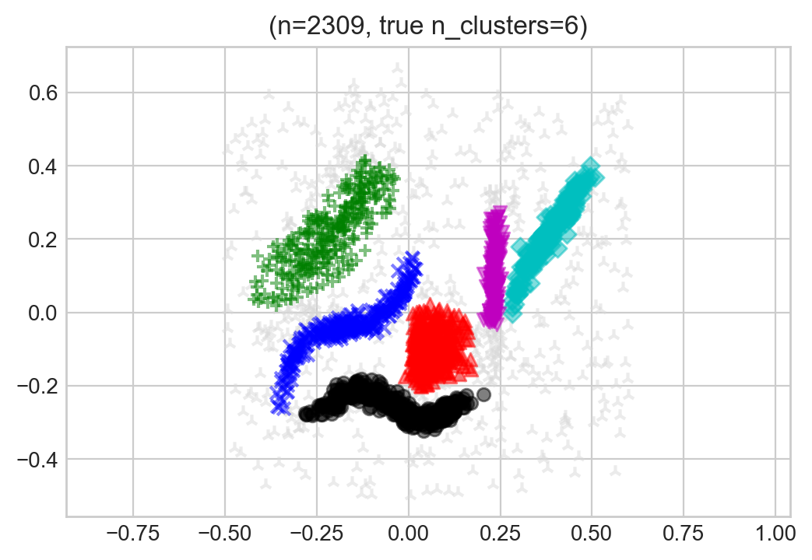
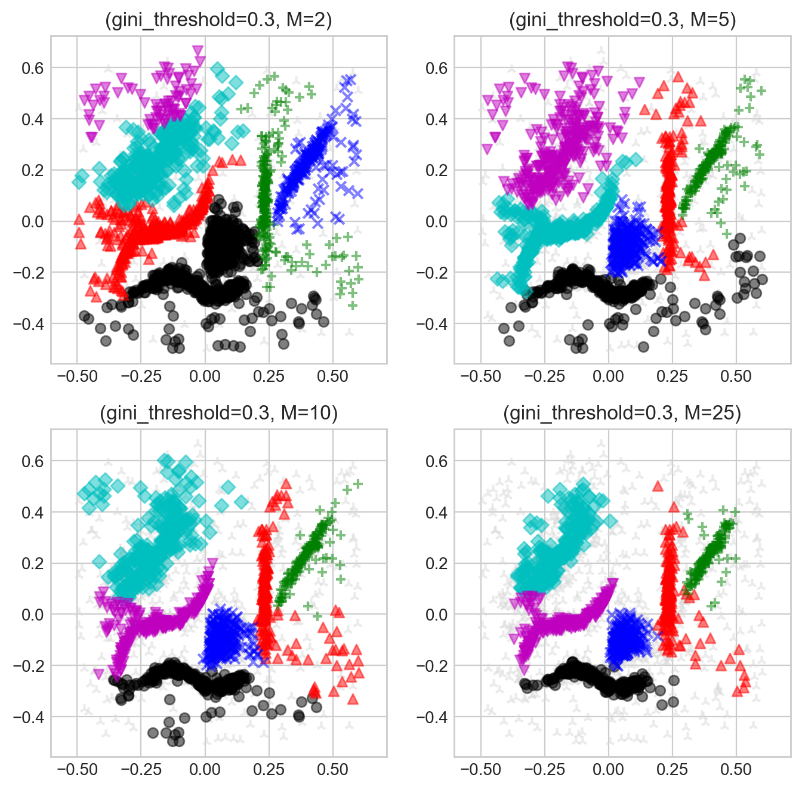
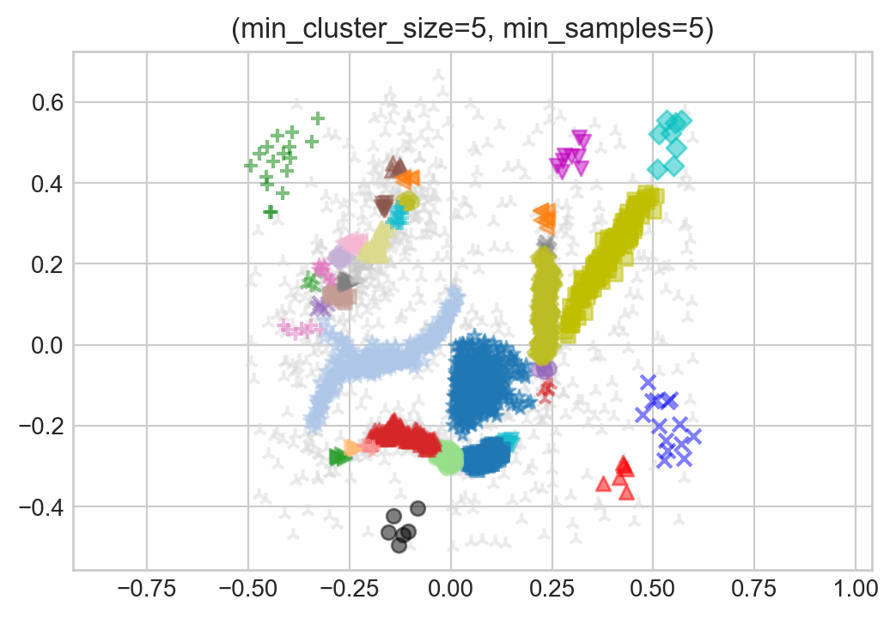
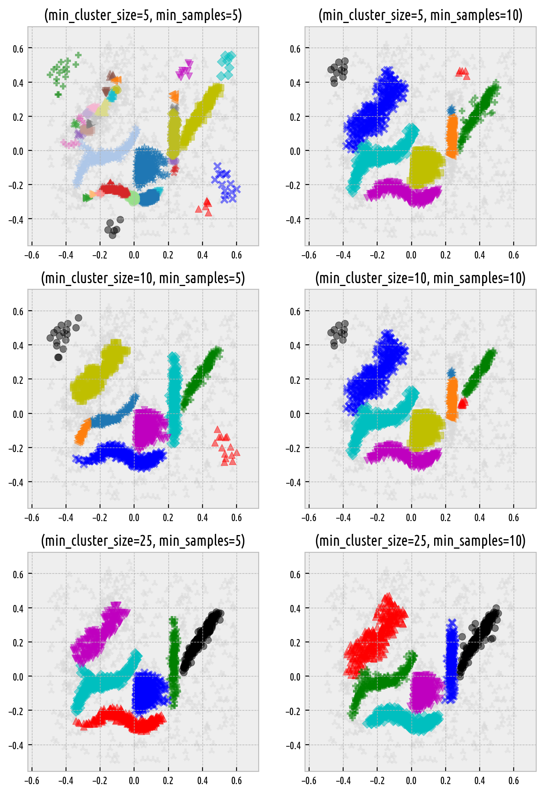

Clustering with Noise Points Detection
======================================

.. code:: python

    import numpy as np
    import pandas as pd
    import matplotlib.pyplot as plt
    import genieclust

Let's load an example data set that can be found
the `hdbscan <https://github.com/scikit-learn-contrib/hdbscan>`_'s
package project site:

.. code:: python

    dataset = "hdbscan"
    X = np.loadtxt("%s.data.gz" % dataset, ndmin=2)
    labels_true = np.loadtxt("%s.labels0.gz" % dataset, dtype=np.intp)-1
    n_clusters = len(np.unique(labels_true[labels_true>=0]))

Note that labels equal to -1 denote noise points.

Here are the "reference" labels as identified by an expert (of course,
each dataset might reveal many different clusterings that a user might
find useful for whatever their goal is):

.. code:: python

    genieclust.plots.plot_scatter(X, labels=labels_true, alpha=0.5)
    plt.title("(n=%d, true n_clusters=%d)" % (X.shape[0], n_clusters))
    plt.axis("equal")
    plt.show()

   Reference labels.

Smoothing Factor
----------------

The `genieclust` package allows for clustering with respect
to a mutual reachability distance,
:math:`d_M`,
known from the HDBSCAN\* algorithm [2]_.
It is parameterised with *a smoothing factor*, ``M``, which
controls how eagerly we tend to classify points as noise.

Contrary to an excellent implementation of HDBSCAN\*
that is featured in the `hdbscan <https://github.com/scikit-learn-contrib/hdbscan>`_
package and which also relies on a minimum spanning tree w.r.t. :math:`d_M`,
here we still have the hierarchical Genie [1]_ algorithm under the hood.
This means we can ask for any number of clusters and get what we asked for.
Moreover, we can easily switch between partitions
of finer or coarser granularity.

Here are the effects of playing with the `M` parameters
(we keep the default `gini_threshold`):

.. code:: python

    Ms = [2, 5, 10, 25]
    for i in range(len(Ms)):
        g = genieclust.genie.Genie(n_clusters=n_clusters, M=Ms[i])
        labels_genie = g.fit_predict(X)
        plt.subplot(2, 2, i+1)
        genieclust.plots.plot_scatter(X, labels=labels_genie, alpha=0.5)
        plt.title("(gini_threshold=%g, M=%d)"%(g.gini_threshold, g.M))
        plt.axis("equal")
    plt.show()

   Labels predicted by Genie with noise point detection.

HDBSCAN\*
---------

Here are the results returned by `hdbscan` with default parameters:

.. code:: python

    import hdbscan

.. code:: python

    h = hdbscan.HDBSCAN()
    labels_hdbscan = h.fit_predict(X)
    genieclust.plots.plot_scatter(X, labels=labels_hdbscan, alpha=0.5)
    plt.title("(min_cluster_size=%d, min_samples=%d)" % (
        h.min_cluster_size, h.min_samples or h.min_cluster_size))
    plt.axis("equal")
    plt.show()

   Labels predicted by HDBSCAN\*.

By tuning `min_cluster_size` and/or `min_samples` (which corresponds to our `M` parameter;
by the way, `min_samples` defaults to `min_cluster_size` if not provided explicitly),
we can obtain a partition that is even closer to the reference one:

.. code:: python

    mcss = [5, 10, 25]
    mss = [5, 10]
    for i in range(len(mcss)):
        for j in range(len(mss)):
            h = hdbscan.HDBSCAN(min_cluster_size=mcss[i], min_samples=mss[j])
            labels_hdbscan = h.fit_predict(X)
            plt.subplot(3, 2, i*len(mss)+j+1)
            genieclust.plots.plot_scatter(X, labels=labels_hdbscan, alpha=0.5)
            plt.title("(min_cluster_size=%d, min_samples=%d)" % (
                h.min_cluster_size, h.min_samples or h.min_cluster_size))
            plt.axis("equal")
    plt.show()

   Labels predicted by HDBSCAN\*.

References
----------

.. [1]
    Gagolewski M., Bartoszuk M., Cena A.,  Genie: A new, fast and
    outlier-resistant hierarchical clustering algorithm,
    *Information Sciences* 363, 2016, 8-23. doi:10.1016/j.ins.2016.05.003.

.. [2]
    Campello R., Moulavi D., Zimek A., Sander J.,
    Hierarchical density estimates for data clustering, visualization,
    and outlier detection,
    *ACM Transactions on Knowledge Discovery from Data* 10(1), 2015, 5:1-5:51.
    doi:10.1145/2733381.
