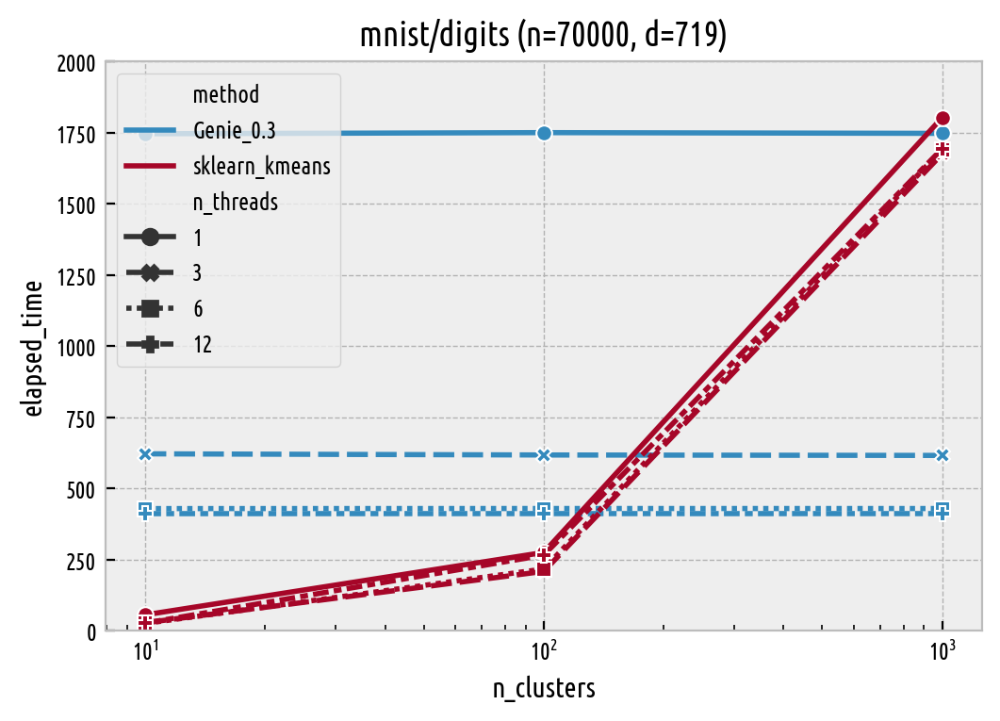
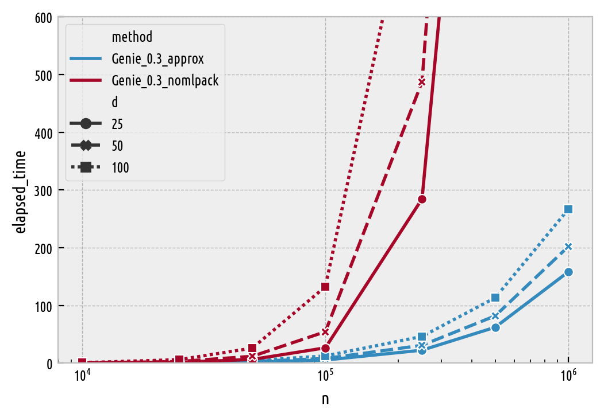

Timings (How Fast Is It?)
=========================

**TODO: under construction.**

In the :any:`previous section <benchmarks_ar>` we have demonstrated
that Genie generates *quality* partitions. Now the crucial question is:
does it do it quickly?

Genie will be compared against K-means from `scikit-learn <https://scikit-learn.org/>`_ version 0.23.1
(`sklearn.cluster.KMeans`) for different number of threads (by default it uses all available resources;
note that `n_init` defaults to 10) and hierarchical agglomerative algorithms
with the centroid, median, and Ward linkage as implemented in the
`fastcluster <http://www.danifold.net/fastcluster.html>`_ package.

The Genie algorithm itself has :math:`O(n \sqrt{n})` time
and :math:`O(n)` memory complexity provided that a minimum spanning
tree of the pairwise distance graph is given.
Generally, our parallelised implementation of a Jarník (Prim/Dijkstra)-like
method [2]_ will be called to compute an MST, which takes :math:`O(d n^2)` time.
However, `mlpack.emst <https://www.mlpack.org/>`_ [3]_ provides a very fast
alternative in the case of Euclidean spaces of (very) low dimensionality,
see [4]_ and the `mlpack_enabled` parameter, which is used by default
for datasets with up to :math:`d=6` features.
Moreover, in the approximate method (`exact` = ``False``) we apply
the Kruskal algorithm on the near-neighbour graph determined
by `nmslib` [5]_. Albeit this only gives *some* sort of a spanning *forest*,
such a data structure :any:`turns out to be very suitable for our clustering task <benchmarks_approx>`\ .

All timings will be performed on a PC running GNU/Linux 5.4.0-40-generic #44-Ubuntu
SMP x86_64 kernel with an Intel(R) Core(TM) i7-9750H CPU @ 2.60GHz (12M cache, 6 cores, 12 threads)
and total memory of 16,242,084 kB.

Large Datasets
--------------

Let's study the algorithm's run times for some of the
"larger" datasets (70,000-105,600 observations,
see section on :any:`benchmark results <benchmarks_ar>` for discussion)
from the
`Benchmark Suite for Clustering Algorithms — Version 1 <https://github.com/gagolews/clustering_benchmarks_v1>`_ [1]_.
Features with variance of 0 were removed,
datasets were centred at **0** and scaled so that they have total variance of 1.
Tiny bit of Gaussian noise was added to each observation.
Clustering is performed with respect to the Euclidean distance.

Here are the results (in seconds) when all the 12 threads, except for `fastcluster` which is not parallelised.
For k-means, the timings are listed as a function of the number of clusters to detect,
for the other hierarchical methods the run-times are almost identical irrespective of the
partitioning's cardinality.

=============  ======  ===  ====================  =======  ======  =======
dataset        n       d    method                     10     100     1000
=============  ======  ===  ====================  =======  ======  =======
mnist/digits   70000   719  Genie_0.3              396.37        
..                          Genie_0.3_approx        42.66        
..                          fastcluster_centroid  4170.98        
..                          fastcluster_median    3927.93        
..                          fastcluster_ward      4114.05        
..                          sklearn_kmeans          27.61  266.17  1694.19
mnist/fashion  70000   784  Genie_0.3              430.07        
..                          Genie_0.3_approx        38.2         
..                          fastcluster_centroid  4486.32        
..                          fastcluster_median    4384.62        
..                          fastcluster_ward      4757.32        
..                          sklearn_kmeans          23.83  243.56  1764.05
sipu/worms_2   105600  2    Genie_0.3                0.58        
..                          Genie_0.3_approx         3.15        
..                          fastcluster_centroid    66.3         
..                          fastcluster_median      64.11        
..                          fastcluster_ward        60.92        
..                          sklearn_kmeans           1.03   12.36   117.99
sipu/worms_64  105000  64   Genie_0.3               68.64        
..                          Genie_0.3_approx         6.98        
..                          fastcluster_centroid  4945.91        
..                          fastcluster_median    2854.27        
..                          fastcluster_ward       778.18        
..                          sklearn_kmeans           4.18   68.21   360.28
=============  ======  ===  ====================  =======  ======  ======= 

Of course, the K-means algorithm is the fastest.
However, its performance degrades as K increases
(**TODO**: extreme clustering)

Timings as a Function of the Number of Threads
----------------------------------------------

Number of threads (jobs):

   Timings [s] as a function of the number of clusters and threads.

**TODO**: for Genie, the number of clusters to extract does not affect
the run-time. Genie itself has :math:`O(n \sqrt{n})` time complexity.

**TODO**: mention cache, show timings — once we determine the MST,
we can play with different `gini_threshold`\ s for "free".

The effect of the curse of dimensionality is clearly visible -- clustering
in very low-dimensional Euclidean spaces is extremely fast.
Then the timings become grow linearly as a function of dimensionality, `d` --
:math:`O(d n^2)` time is needed.

Importantly, the algorithm only needs :math:`O(n)` memory.

TODO: mention extreme clustering

Timings as a Function of `n` and `d`
------------------------------------

Synthetic datasets being two Gaussian blobs, each of size `n/2`
(with i.i.d. coordinates), in a `d`-dimensional space.

Medians of 1,3, or 10 timings (depending on the dataset size), in seconds,
on 6 threads:

==================  ===  =======  =======  ========  ========  =========
method                d    10000    50000    100000    500000    1000000
==================  ===  =======  =======  ========  ========  =========
Genie_0.3_approx      2     0.17     0.98      2.12     14.93      33.79
..                    5     0.2      1.3       2.87     22.75      54.66
..                   10     0.25     1.69      3.84     36.18      92.03
..                   25     0.29     1.95      5.46     62.25     158.27
..                   50     0.36     3.15      8.15     81.95     202.08
..                  100     0.48     4.6      12.6     113.37     266.64
Genie_0.3_mlpack      2     0.04     0.26      0.55      3.03       6.58
..                    5     0.28     1.96      4.46     28.4       62.75
..                   10     3.08    35.54     92.87    794.71    2014.59
Genie_0.3_nomlpack    2     0.16     2.52      9.87    267.76    1657.86
..                    5     0.14     2.62     11.4     421.46    2997.11
..                   10     0.15     3.21     12.74    719.33    4388.26
..                   25     0.28     6.51     26.65   1627.9     7708.23
..                   50     0.47    11.97     54.52   2175.3    11346.3
..                  100     1       26.07    132.47   4408.07   16021.8
==================  ===  =======  =======  ========  ========  ========= 

By default, `mlpack_enabled` is ``"auto"``, which translates
to ``True`` if the requested metric is Euclidean, `mlpack` Python package is available
and `d` is not greater than 6.

   Timings [s] as a function of the dataset size and dimensionality — problem sizes that can be solved during a coffee-break.

**TODO:** conclusions

References
----------

.. [1]
    Gagolewski M., Cena A. (Eds.), *Benchmark Suite for Clustering Algorithms — Version 1*,
    2020. https://github.com/gagolews/clustering_benchmarks_v1. doi:10.5281/zenodo.3815066.

.. [2]
    Olson C.F., Parallel algorithms for hierarchical clustering,
    *Parallel Computing* 21(8), 1995, 1313-1325.
    doi:10.1016/0167-8191(95)00017-I.

.. [3]
    Curtin R.R., Edel M., Lozhnikov M., Mentekidis Y., Ghaisas S., Zhang S.,
    mlpack 3: A fast, flexible machine learning library,
    *Journal of Open Source Software* 3(26), 726, 2018.
    doi:10.21105/joss.00726.

.. [4]
    March W.B., Ram P., Gray A.G.,
    Fast Euclidean Minimum Spanning Tree: Algorithm, Analysis, and Applications,
    *Proc. ACM SIGKDD'10*, 2010, 603-611.

.. [5]
    Naidan B., Boytsov L., Malkov Y.,  Novak D.,
    *Non-metric space library (NMSLIB) manual*, version 2.0, 2019.
    https://github.com/nmslib/nmslib/blob/master/manual/latex/manual.pdf.
