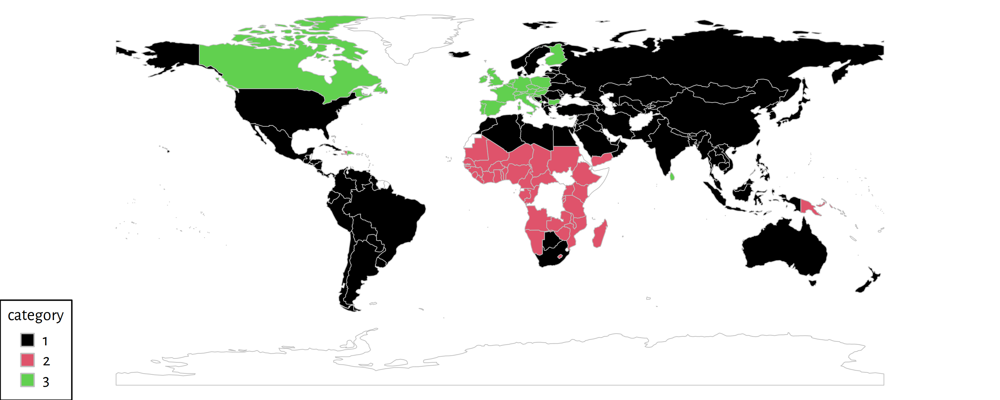

# R Interface Examples

The latest stable release of the R package `genieclust` is available from the
[CRAN](https://cran.r-project.org/web/packages/genieclust/) repository.
We can install it by calling:


```r
install.packages("genieclust")
```


Below are a few basic examples of how to interact with the package.
<!-- (partially based on Marek's [forthcoming book](https://lmlcr.gagolewski.com)). -->


```r
library("genieclust")
```


Let's consider the [Sustainable Society Indices](http://www.ssfindex.com/)
dataset that measures the Human, Environmental, and Economic Wellbeing
in each country based on seven categories on the scale $[0, 10]$.


```r
# see https://github.com/gagolews/genieclust/tree/master/devel/sphinx/weave
ssi <- read.csv("ssi_2016_categories.csv", comment.char="#")
X <- as.matrix(ssi[,-1])    # everything except the Country (1st) column
dimnames(X)[[1]] <- ssi[,1] # set row names
head(X)  # preview
```

```
##           BasicNeeds PersonalDevelopmentAndHealth WellBalancedSociety NaturalResources ClimateAndEnergy Transition  Economy
## Albania     9.605769                     7.959609            6.992649         6.634251         4.621681   2.102542 3.056494
## Algeria     9.021185                     7.336496            4.203906         5.277173         2.662674   3.074134 6.154272
## Angola      5.972848                     5.692808            2.140138         6.759396         6.212197   1.898812 3.753476
## Argentina   9.831955                     8.350592            3.895167         5.453451         3.300326   6.389867 5.340636
## Armenia     9.446943                     7.420523            6.289224         6.436303         2.854317   2.434233 3.829620
## Australia  10.000000                     8.590927            6.105539         4.130701         1.627805   7.539498 7.593052
```


`genieclust` has an interface compatible with R's workhorse
for hierarchical clustering, `stats::hclust()`.
Yet, for efficiency reasons, it's better to feed `genieclust::glust()`
with the input matrix directly:


```r
# faster than gclust(dist(X)):
h <- gclust(X)  # default: gini_threshold=0.3, distance="euclidean"
print(h)
```

```
## 
## Call:
## gclust.mst(d = mst.default(d, M = 1L, distance = distance, verbose = verbose,     cast_float32 = cast_float32), gini_threshold = gini_threshold,     verbose = verbose)
## 
## Cluster method   : Genie(0.3) 
## Distance         : euclidean 
## Number of objects: 154
```

In order to extract a desired *k*-partition, we can call `stats::cutree()`:


```r
y_pred <- cutree(h, k=3)
sample(y_pred, 25)  # preview
```

```
##       Bolivia         Ghana        Russia      Ethiopia      Zimbabwe         Yemen    Mauritania     Mauritius United States        Mexico      Thailand       Namibia  Korea, North         Chile       Austria       Ukraine       Lebanon         Libya       Vietnam     Nicaragua       Romania          Laos Cote d'Ivoire        Panama       Tunisia 
##             1             2             1             2             2             2             2             1             1             1             1             2             1             1             3             1             1             1             1             1             1             1             2             1             1
```

This gives the cluster ID allocated to each country.
Let's depict the obtained partition using the `rworldmap` package:


```r
library("rworldmap")  # see the package's manual for details
mapdata <- data.frame(Country=dimnames(X)[[1]], Cluster=y_pred)
mapdata <- joinCountryData2Map(mapdata, joinCode="NAME", nameJoinColumn="Country")
mapCountryData(mapdata, nameColumnToPlot="Cluster", catMethod="categorical",
    missingCountryCol="white", colourPalette=palette.colors(3, "R4"),
    mapTitle="")
```




We can compute, e.g., the average indicators in each identified group:


```r
t(aggregate(as.data.frame(X), list(Cluster=y_pred), mean))[-1, ]
```

```
##                                  [,1]     [,2]     [,3]
## BasicNeeds                   9.067901 5.268879 9.817850
## PersonalDevelopmentAndHealth 7.508130 5.931156 8.299537
## WellBalancedSociety          4.886885 2.868176 6.827154
## NaturalResources             5.663252 7.004013 6.374348
## ClimateAndEnergy             3.624147 7.081801 3.594718
## Transition                   4.074894 2.630009 7.340152
## Economy                      5.512709 3.541081 4.274155
```


Dendrogram plotting is also possible.
For greater readability, we'll restrict ourselves to a smaller sample;
namely, to the 37 members of the [OECD](https://en.wikipedia.org/wiki/OECD):


```r
oecd <- c("Australia", "Austria", "Belgium", "Canada", "Chile", "Colombia",
"Czech Republic", "Denmark", "Estonia", "Finland", "France", "Germany",
"Greece", "Hungary", "Iceland", "Ireland", "Israel", "Italy", "Japan",
"Korea, South", "Latvia", "Lithuania", "Luxembourg", "Mexico", "Netherlands",
"New Zealand", "Norway", "Poland", "Portugal", "Slovak Republic", "Slovenia",
"Spain", "Sweden", "Switzerland", "Turkey", "United Kingdom", "United States")
X_oecd <- X[dimnames(X)[[1]] %in% oecd, ]
```


```r
h_oecd <- gclust(X_oecd)
plot(h_oecd)
```


Final notes:

* If we are only interested in a specific partition,
calling `genie()` directly will be slightly faster than referring to
`cutree(gclust(...))`.

* `genieclust` also features partition similarity scores
(such as the Adjusted Rand or the Pair Sets Index) that can be used as
external cluster validity measures.

For more details, refer to the package's {any}`documentation <../rapi>`.
Don't forget to check out the Python examples regarding noise points detection,
benchmarking, timing, etc.
